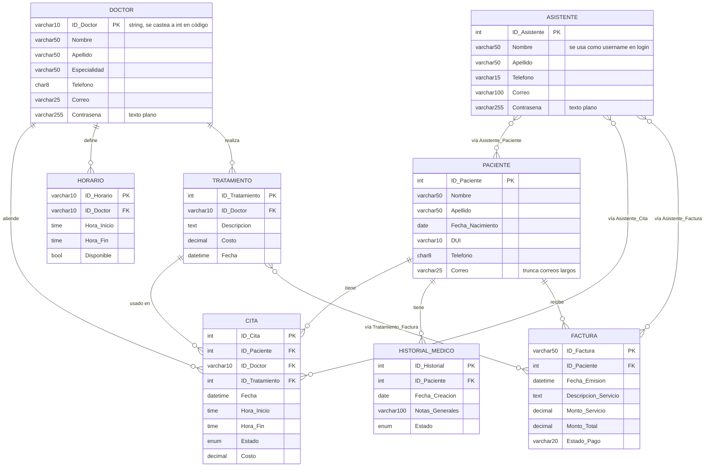
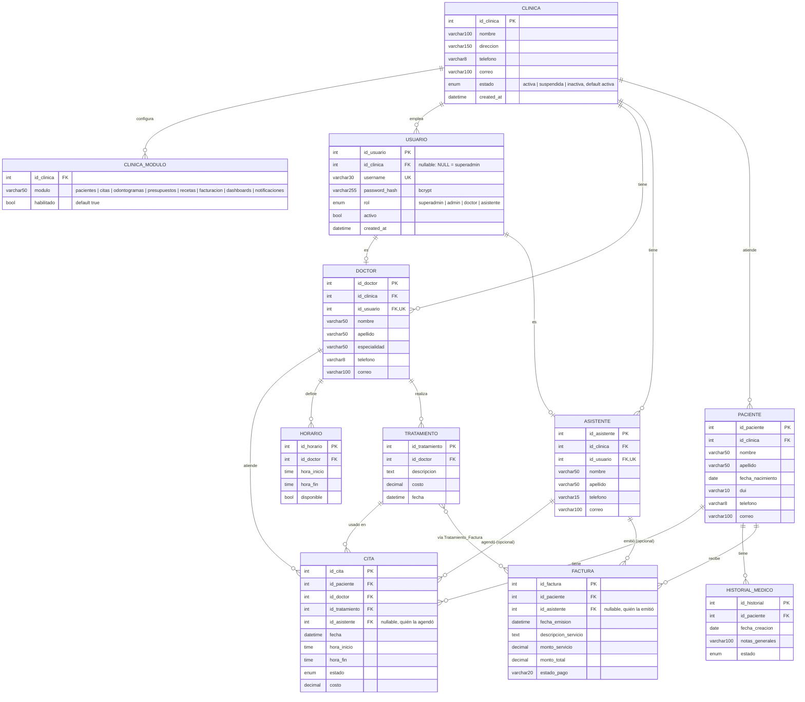
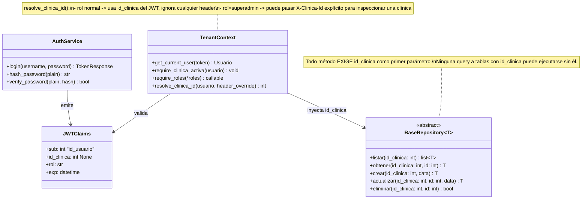

# Diseño: Núcleo Multi-Tenant (Clínica + Usuario + Auth) — Módulo 1

**Fecha:** 2026-07-30
**Estado:** Aprobado para pasar a plan de implementación
**Repo destino:** ClinicaDentalWeb (proyecto nuevo/modernizado)
**Repo legacy de referencia:** ClinicaDental (MVC + PyQt6 + MySQL, sin cambios directos)

## 1. Contexto

El proyecto legacy `ClinicaDental` es un sistema de escritorio (PyQt6 + MySQL) para una única
clínica dental ("Dental Smiling"). Se decidió modernizarlo reescribiéndolo como una plataforma
web multi-clínica (multi-tenant), con backend FastAPI y frontend a definir, manteniendo
`ClinicaDental` intacto como referencia de solo lectura.

### Problemas identificados en el legacy (auditoría as-is)

- Contraseñas en texto plano (`Doctor.Contrasena`, `Asistente.Contrasena`).
- Login usa `Asistente.Nombre` como si fuera username — no existe un campo de username real.
- `ID_Doctor` es `VARCHAR(10)` en la BD pero se castea a `int` en varios puntos del código
  (`Modelos/DoctorModelo.py`, `Modelos/TratamientoModelo.py`).
- `Correo VARCHAR(25)` trunca correos electrónicos normales.
- Contadores de ID manuales en memoria (`Paciente._contador_id`, `Cita._contador_id`) en vez de
  depender de `AUTO_INCREMENT`.
- `validar_telefono` en `PacienteModelo.py` se usa como `@staticmethod` pero no tiene el decorador.
- Bloques completos de datos hardcodeados comentados como "respaldo" (dead code) en
  `DoctorModelo.py`.
- `sys.path.append` repetido en cada archivo en vez de paquetes Python reales.
- `print()` en vez de `logging` en toda la capa de modelo.
- Los "modelos" mezclan datos, validación y acceso a BD (SQL embebido) en la misma clase
  (god classes) — no hay separación Modelo/Repositorio.
- Tablas `Asistente_Paciente`, `Asistente_Cita`, `Asistente_Factura` (M:N) sin que quede claro
  que aportan valor de negocio real sobre una simple auditoría 1:N.

### Diagrama ER as-is

### Diagrama de clases as-is (capa `Modelos/`)

```mermaid
classDiagram
    class Paciente {
        -_contador_id: int $
        -_pacientes_existentes: list $
        +id_paciente: int
        +nombre: str
        +telefono: int
        +correo: str
        +calcular_edad() int
        +get_balance_total() float
        +validar_telefono(telefono)$ bool
        +insertar_en_bd(paciente)$ bool
        +obtener_todos_los_pacientes()$ list
    }
    note for Paciente "God class: datos + validación + SQL.\nContador de ID en memoria.\nvalidar_telefono sin @staticmethod pero usado como tal."

    class Doctor {
        +num_junta_medica
        +nombre: str
        +citas: list
        +horario: list
        +obtener_doctores_desde_db()$ list
        +insert_doc_db(doctor)$ bool
    }
    note for Doctor "~150 líneas de datos hardcodeados comentados\ncomo 'respaldo' (dead code).\nnum_junta_medica vs id_doctor inconsistente."

    class Cita {
        -_contador_id: int $
        +id_cita: int
        +paciente: Paciente
        +doctor: Doctor
        +estado: str
    }
    note for Cita "Otro contador de ID en memoria, mismo patrón que Paciente."

    class Tratamiento {
        +id_doctor
        +descripcion: str
        +costo: float
    }
    note for Tratamiento "Depende de PyQt6.QtCore.QDate en la capa de 'modelo'."

    class Horario {
        +id_horario: str
        +doctor: Doctor
        +horario_ocupado(otro) bool
    }

    class Factura {
        +id_factura: str
        +paciente: Paciente
    }
    class FacturacionModel {
        +generar_id_factura_automatico()$ str
    }
    note for FacturacionModel "Genera 'F001','F002'... con SELECT + parseo de string\nen vez de PK autoincrement."

    class LoginModelo {
        +validar_usuario(usuario, password) bool
        +obtener_tipo_usuario(usuario) str
    }
    note for LoginModelo "Compara Contrasena en texto plano.\n'usuario' = Asistente.Nombre.\nNo existe clase Asistente propia."

    Cita --> Paciente
    Cita --> Doctor
    Horario --> Doctor
    Factura --> Paciente
    Tratamiento --> Doctor
```

## 2. Roadmap general (decisión de alcance)

El trabajo se organiza en fases; este documento cubre el detalle del primer módulo del bloque
de administración de clínicas.

- **Fase 0 — Diagramas** (este documento: as-is + to-be).
- **Fase 1 — Backend / Núcleo**: seguridad (bcrypt, JWT, `.env`), arquitectura (Repositorio,
  paquetes reales, logging), FastAPI, tests, Docker.
- **Fase 2 — Frontend**: reescritura de vistas.
- **Módulo de administración de clínicas** (priorizado dentro de Fase 1, antes de continuar con
  el resto del backend), dividido en:
  1. **Tenancy + Auth core** — `Clinica`, `Usuario`, aislamiento por `id_clinica` (este doc).
  2. Panel superadministrador (CRUD de clínicas, asignar admin, activar/suspender).
  3. Parámetros por clínica (`ConfiguracionClinica`, `Especialidad`, `Consultorio`).
  4. Operación clínica básica (Pacientes, Odontólogos, Asistentes, Citas, Horarios) con
     aislamiento por clínica.
  5. Expediente clínico avanzado (Diagnósticos, Odontogramas, Planes de tratamiento,
     Presupuestos, Recetas, historial de consultas).
  6. Facturación extendida (Presupuesto → Plan de tratamiento → Factura, impuestos,
     numeración configurable).
  7. Dashboards y métricas (superadmin + por clínica).
  8. Notificaciones y recordatorios.

## 3. Diagrama ER to-be (núcleo multi-tenant)

### Decisiones de diseño y justificación

| Decisión | Justificación |
|---|---|
| Multi-tenant desde ya (`Clinica` como raíz) | Habilita directamente el módulo de administración de clínicas sin rediseñar el esquema después. |
| `Usuario` unificado (no username/password duplicado en Doctor y Asistente) | Login, JWT y roles en un solo lugar; agregar roles nuevos (superadmin) no implica duplicar lógica de auth. |
| `Usuario.id_clinica` **nullable**, `NULL` = superadmin | Un superadmin no pertenece a una clínica; se evita una tabla de auth paralela. |
| PKs `INT AUTO_INCREMENT` en todo (elimina `"1234"`, `"H001"`, `"F001"`) | Elimina contadores manuales en memoria y parsing de strings tipo `F001`; simplifica tipos consistentes. |
| `Asistente_Paciente`, `Asistente_Cita`, `Asistente_Factura` (3 tablas M:N) → eliminadas | Se confirmó que la relación real es auditoría 1:N ("quién agendó/emitió"), no colaboración M:N. Se reemplaza por `id_asistente` nullable directo en `Cita` y `Factura`; `Asistente_Paciente` se elimina del todo (con auth por rol, cualquier asistente autenticado ve cualquier paciente de su clínica). |
| `Correo VARCHAR(100)` en todas las tablas | `VARCHAR(25)` truncaba correos reales. |
| `ClinicaModulo` (feature flags por módulo) en vez de un campo `plan` simple | El superadmin necesita habilitar/deshabilitar módulos individuales (ej. una clínica sin Recetas) desde el día uno. |
| Entidad `Doctor` se mantiene con ese nombre (no se renombra a `Odontologo`) | Evita romper continuidad con el legacy; "odontólogo" queda como término de UI/negocio. Reversible si el equipo prefiere renombrar. |
| Suspender/desactivar una clínica bloquea login inmediatamente para todos sus usuarios | Es el comportamiento esperado de un `estado != 'activa'`; los datos no se tocan, solo el acceso. |

## 4. Arquitectura de aislamiento multi-tenant (backend)

Requisito explícito del negocio: **la separación de datos se valida obligatoriamente en el
backend usando el `id_clinica` del usuario autenticado — nunca solo con filtros de frontend.**

Regla dura de diseño: **ningún repositorio expone un método que no reciba `id_clinica`**. El
aislamiento no depende de que cada desarrollador recuerde agregar `WHERE id_clinica = ...` —
la firma del método lo obliga.

## 5. Endpoints de este módulo

Este módulo cubre solo auth/tenancy. El CRUD completo de clínicas es el Módulo 2 (panel
superadministrador), fuera de alcance aquí.

- `POST /auth/login` — valida `Usuario` + `Clinica.estado == 'activa'` (salvo rol `superadmin`,
  que no tiene clínica asociada) → devuelve JWT con claims `sub`, `id_clinica`, `rol`.
- `GET /auth/me` — devuelve usuario, rol y clínica actual.
- `POST /auth/logout` — invalidación del lado cliente (blacklist de tokens queda fuera de
  alcance de este módulo; se puede agregar después si se requiere revocación inmediata).

## 6. Fuera de alcance de este módulo

- CRUD de clínicas (Módulo 2).
- `ConfiguracionClinica`, `Especialidad`, `Consultorio` (Módulo 3).
- Migración de datos reales del legacy (`ClinicaDental`) hacia el nuevo esquema — se abordará
  como tarea explícita dentro de Fase 1 cuando el esquema esté estable.
- Blacklist/revocación de JWT antes de expiración.
