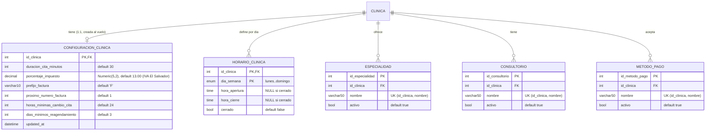

# Diseño: Parámetros por Clínica — Módulo 3

**Fecha:** 2026-07-31
**Estado:** Aprobado para pasar a plan de implementación
**Ticket:** BE-03 · **Asignado:** Meli
**Depende de:** Módulo 1 (Tenancy + Auth core) y Módulo 2 (Panel superadministrador) — ambos
implementados y en `main`.

## 1. Contexto

Los Módulos 1 y 2 dejaron listas las tablas `Clinica`, `Usuario` y `ClinicaModulo`, el login con
JWT, el mecanismo de aislamiento por `id_clinica` (`BaseRepository` + `resolve_clinica_id`) y el
panel del superadmin. Ambos specs declararon `ConfiguracionClinica`, `Especialidad` y
`Consultorio` como **fuera de alcance, Módulo 3** (spec Módulo 1, sección 6).

Este documento cubre esos parámetros: los catálogos y la configuración operativa que cada clínica
define para sí misma, y que los módulos siguientes van a consumir. Es la base del Módulo 4
(`Doctor.id_especialidad`, `Cita.id_consultorio`, validación de horario de una cita contra el
horario de atención, duración de cita por defecto) y del Módulo 6 (`Factura.id_metodo_pago`,
porcentaje de impuesto, numeración de facturas).

Dato relevante: **este módulo es el primer consumidor real de `resolve_clinica_id`.** Los Módulos
1 y 2 nunca lo usaron, porque `/clinicas` opera sobre clínicas en sí mismas y recibe el
`id_clinica` en la URL. El patrón que se establezca acá es el que van a copiar los Módulos 4 a 8.

## 2. Alcance

Dentro de este módulo:

- `Especialidad` — catálogo por clínica (nombre, activo)
- `Consultorio` — catálogo por clínica (nombre, activo)
- `MetodoPago` — catálogo por clínica (nombre, activo)
- `HorarioClinica` — horario de atención de la clínica, una fila por día de la semana
- `ConfiguracionClinica` — parámetros escalares, 1:1 con `Clinica`
- `CatalogoRepository[T]` — implementación única del CRUD de catálogos, sobre `BaseRepository`
- Endpoints CRUD de los tres catálogos + GET/PUT de horarios + GET/PUT de configuración

Fuera de alcance, con su justificación:

| Queda fuera | Por qué |
|---|---|
| Catálogo de servicios/precios como entidad propia | El ERD to-be del Módulo 1 no tiene entidad `Servicio`: los precios viven en `Tratamiento` (`id_doctor`, `descripcion`, `costo`), que es Módulo 5/6. La tabla del roadmap en Notion menciona "servicios/precios" en el Módulo 3, pero el checklist detallado de BE-03 y el ERD coinciden en que no corresponde acá. |
| `Horario` por doctor (`id_doctor`, `hora_inicio`, `hora_fin`, `disponible`) | Es una entidad distinta y pertenece al Módulo 4. El horario de este módulo es el de la **clínica**, el marco dentro del cual después caen las agendas de cada doctor. |
| FK `Doctor.id_especialidad` y `Cita.id_consultorio` | Las tablas `Doctor` y `Cita` no existen todavía (Módulo 4). Acá solo se crean las tablas que después van a ser referenciadas. |
| Validar que una cita caiga dentro del horario de atención | Módulo 4, cuando exista `Cita`. |
| Aplicar las reglas de cancelación y reagendamiento | Módulo 4. Acá solo se almacenan los parámetros (`horas_minimas_cambio_cita`, `dias_minimos_reagendamiento`) que esa lógica va a leer. |
| Consumir `proximo_numero_factura` para emitir facturas | Módulo 6. Acá solo se almacena y configura el valor. |
| Agregar entradas nuevas a `MODULOS_DISPONIBLES` | Los parámetros por clínica no son un módulo toggleable: son configuración base que toda clínica necesita. No se toca ese archivo compartido. |

## 3. Modelo de datos

Cinco tablas nuevas. Migración `0003_parametros_por_clinica.py` (`down_revision = "0002"`).



Todos los modelos viven en `app/models/parametros.py` (un archivo por grupo de entidades
relacionadas, según la convención del repo) y se exportan desde `app/models/__init__.py`.

### `DiaSemana` (enum nuevo)

```python
class DiaSemana(str, enum.Enum):
    LUNES = "lunes"
    MARTES = "martes"
    MIERCOLES = "miercoles"
    JUEVES = "jueves"
    VIERNES = "viernes"
    SABADO = "sabado"
    DOMINGO = "domingo"
```

Se declara con `values_callable=lambda enum_cls: [e.value for e in enum_cls]`, igual que
`EstadoClinica` y `RolUsuario`. Sin eso, SQLAlchemy persiste `LUNES` en vez de `lunes` y el bug
**no se detecta en los tests con SQLite** — solo revienta contra MySQL real (bug conocido #2 del
`CONTEXTO-PROYECTO.md`). Los valores van sin tilde (`miercoles`, `sabado`) para evitar problemas
de encoding en el tipo ENUM de MySQL.

### Decisiones de modelado y su justificación

| Decisión | Justificación |
|---|---|
| Los tres catálogos comparten exactamente la forma `(id, id_clinica, nombre, activo)` | Permite implementar el CRUD una sola vez (`CatalogoRepository`) en vez de tres veces casi iguales. La abstracción está justificada por tres casos reales, no por anticipación. |
| Unicidad `UniqueConstraint(id_clinica, nombre)` en cada catálogo | Dos clínicas distintas pueden tener ambas "Ortodoncia"; la misma clínica no puede tenerla dos veces. La restricción se aplica en la BD, no solo en código. |
| Borrado lógico (`activo: bool`) en los tres catálogos, no borrado físico | En el Módulo 4, `Doctor.id_especialidad` y `Cita.id_consultorio` van a apuntar a estas filas. Borrar físicamente rompería expedientes y facturas históricas. El borrado lógico además cumple OCP: no hay que volver a abrir este código en el Módulo 4 para agregar validaciones de "está en uso" — la alternativa (borrado físico con `409 Conflict`) exigiría consultar tablas que hoy no existen y dejaría el `DELETE` deliberadamente incompleto. |
| El listado filtra `activo = True` por defecto, con `?incluir_inactivos=true` para ver todo | Un formulario de alta no debe ofrecer especialidades dadas de baja; una pantalla de administración sí necesita poder verlas y reactivarlas. |
| `HorarioClinica` con llave compuesta `(id_clinica, dia_semana)` en vez de un `id` autoincremental | Impide a nivel de esquema que existan dos filas para el mismo día en la misma clínica. Mismo criterio que `ClinicaModulo`. |
| Una fila por día en lugar de columnas planas (`hora_apertura` / `hora_cierre` / `dias_laborales`) | El caso real de negocio tiene horarios distintos según el día: L-V de 08:00 a 17:00, sábado de 08:00 a 12:00, domingo cerrado. Columnas planas no representan eso. Un JSON sí, pero no se puede consultar ni validar desde SQL y se comporta distinto en SQLite y MySQL — y el Módulo 4 necesita consultar el horario para validar citas. |
| `cerrado: bool` explícito en vez de inferir "cerrado" de `hora_apertura IS NULL` | Hace la intención explícita y evita que un `NULL` accidental se lea como día cerrado. Las horas son nullable solo para el caso `cerrado = True`. |
| `MetodoPago` como tabla normalizada, no como columnas booleanas en `ConfiguracionClinica` | Cumple OCP: agregar un método de pago es dato (un `POST`), no código (migración + columna + schema + los lugares que la leen). Mantiene la responsabilidad única de `ConfiguracionClinica` (parámetros escalares) separada de la de ser catálogo. Y permite que `Factura` del Módulo 6 guarde una FK `id_metodo_pago` en vez de texto libre, evitando condicionales que conozcan nombres literales de métodos. Cada clínica puede definir nombres propios ("Visa BAC") sin tocar el esquema. |
| `ConfiguracionClinica.id_clinica` es PK y FK a la vez | Fuerza la relación 1:1 en el esquema. No hay forma de crear dos configuraciones para la misma clínica. |
| `porcentaje_impuesto` como `Numeric(5, 2)`, no `Float` | Es un valor monetario/fiscal; `Float` introduce errores de redondeo. Rango suficiente: hasta 999.99. |
| `porcentaje_impuesto` con default `13.00` | Es el IVA vigente en El Salvador, el caso normal de la clínica. Sigue siendo configurable por clínica: una clínica exenta o de otro país lo cambia con `PUT /configuracion`. |
| Horario por defecto: lunes a viernes 08:00–17:00 abierto, sábado y domingo `cerrado = true` | Es la semana laboral típica. Una clínica que abra sábados lo habilita explícitamente, en vez de tener que acordarse de cerrar días que nunca atendió. |
| Un solo campo `horas_minimas_cambio_cita` para cancelar y reagendar, en vez de dos campos separados | Ambas reglas valen 24 h y no hay un caso de negocio que las diferencie hoy (YAGNI). Se nombra `cambio_cita` y no `cancelacion` justamente porque gobierna las dos acciones. Si más adelante la clínica quiere ser más permisiva con reagendar, se parte en dos campos con una migración trivial. |
| `dias_minimos_reagendamiento` como campo aparte (default 3) | Es una regla distinta y no reducible a la anterior: una mide anticipación **respecto de la cita vieja** (cuándo avisás), la otra mide distancia **respecto de la cita nueva** (para cuándo la movés). Unidades distintas (horas vs días) y semántica distinta. |
| Ambos parámetros de cambio de cita tienen mínimo `1`, no `0` | La regla es configurable en su intensidad pero no desactivable: una clínica puede pedir 2 días en vez de 3, o 12 horas en vez de 24, pero no puede permitir reagendar para el mismo día ni cancelar sobre la hora. El default (24 h / 3 días) es la política acordada; el piso de `1` evita que una mala configuración anule la protección. |
| La fila de `ConfiguracionClinica` se crea al vuelo en el primer `GET`, no al crear la clínica | No modifica `ClinicaService.crear_clinica_con_admin()` (código del Módulo 2, de Christian) ni sus tests, y no requiere una migración de datos para las clínicas que ya existen en la BD. El costo aceptado es que un `GET` escribe: es idempotente y no observable por el cliente. La alternativa (crearla en el service) dejaría un `404` en cualquier clínica preexistente si la migración de datos fallara u se olvidara. |

## 4. Arquitectura de repositorios

### `CatalogoRepository[T]` (nuevo, **sí** hereda de `BaseRepository`)

Implementa una única vez el CRUD compartido por los tres catálogos:

```python
class CatalogoRepository(BaseRepository[T]):
    """CRUD de catalogos por clinica: nombre unico por clinica, borrado logico."""

    model: type[T]  # lo define cada subclase

    def listar(self, id_clinica: int, incluir_inactivos: bool = False) -> list[T]: ...
    def obtener(self, id_clinica: int, id_: int) -> T | None: ...
    def crear(self, id_clinica: int, data: dict) -> T: ...
    def actualizar(self, id_clinica: int, id_: int, data: dict) -> T | None: ...
    def eliminar(self, id_clinica: int, id_: int) -> bool: ...
```

Comportamiento:

- `listar` filtra siempre por `id_clinica`, y por `activo = True` salvo `incluir_inactivos=True`.
  Ordena por `nombre`.
- `obtener` devuelve `None` si el registro no existe **o pertenece a otra clínica** (nunca se
  filtra solo por PK).
- `crear` lanza `NombreDuplicadoEnClinicaError` si ya existe un registro con ese `nombre` en esa
  clínica (comparación normalizada: `strip()` y case-insensitive), incluyendo los inactivos —
  reactivar es la acción correcta, no crear un duplicado. La comparación case-insensitive se hace
  con `func.lower()` explícito en la query, **no** confiando en el collation de la base: SQLite es
  case-sensitive por defecto y el collation `utf8mb4_general_ci` de MySQL no lo es, así que sin el
  `lower()` explícito el test pasaría en SQLite con un comportamiento distinto al de producción.
- `actualizar` aplica solo las claves presentes en `data` (actualización parcial), valida
  duplicado si cambia el `nombre`, devuelve `None` si no existe en esa clínica. Puede volver a
  poner `activo = True` (reactivación).
- `eliminar` pone `activo = False` y devuelve `True`; devuelve `False` si no existe en esa
  clínica. Idempotente: desactivar algo ya inactivo devuelve `True`.
- Todos los métodos hacen `.flush()`, nunca `.commit()`. El `.commit()` lo hace la ruta.

`incluir_inactivos` es un parámetro con default, por lo que la firma sigue siendo compatible con
`BaseRepository.listar(self, id_clinica)` (LSP: cualquier consumidor del contrato base sigue
funcionando).

Subclases, de dos líneas cada una:

```python
class EspecialidadRepository(CatalogoRepository[Especialidad]):
    model = Especialidad

class ConsultorioRepository(CatalogoRepository[Consultorio]):
    model = Consultorio

class MetodoPagoRepository(CatalogoRepository[MetodoPago]):
    model = MetodoPago
```

Si un catálogo divergiera más adelante (ej. `Consultorio` con `numero_piso`), la subclase agrega
o sobrescribe lo suyo sin afectar a los otros dos.

### `HorarioClinicaRepository` (nuevo, **no** hereda de `BaseRepository`)

Misma excepción documentada que `ClinicaModuloRepository`: la llave es compuesta
(`id_clinica` + `dia_semana`, un enum), no un `int` simple como asume la firma de
`BaseRepository`. Sí exige `id_clinica` como primer parámetro en todos sus métodos.

```python
def listar_semana(self, id_clinica: int) -> list[HorarioClinica]: ...
def reemplazar_semana(self, id_clinica: int, dias: list[dict]) -> list[HorarioClinica]: ...
```

- `listar_semana` devuelve las filas existentes ordenadas de lunes a domingo (el relleno de los
  días faltantes con defaults es responsabilidad de la ruta, no del repositorio).
- `reemplazar_semana` hace upsert de los 7 días recibidos: actualiza los que existen, crea los
  que faltan. Valida cada día y lanza `HorarioInvalidoError` con el día en el mensaje.

### `ConfiguracionClinicaRepository` (nuevo, **no** hereda de `BaseRepository`)

La relación es 1:1 y la PK *es* `id_clinica`, así que `obtener(id_clinica, id_)` no tiene
sentido.

```python
def obtener_o_crear(self, id_clinica: int) -> ConfiguracionClinica: ...
def actualizar(self, id_clinica: int, data: dict) -> ConfiguracionClinica: ...
```

- `obtener_o_crear` devuelve la fila existente, o crea una con los valores por defecto del modelo
  y la devuelve. Idempotente: dos llamadas seguidas no crean dos filas.
- `actualizar` llama internamente a `obtener_o_crear` y aplica solo las claves presentes en
  `data`. Toca `updated_at`.

Los valores por defecto viven **únicamente** en los `default` / `server_default` del modelo
`ConfiguracionClinica`. No se repiten en el repositorio ni en los schemas.

### Sin capa de service

Los cinco recursos son CRUD de una sola entidad, sin transacciones que coordinen varias
escrituras relacionadas. Según la convención del repo (`CONTEXTO-PROYECTO.md`, sección 7.4), en
ese caso la ruta llama al repositorio directamente — igual que hace la mayoría de
`app/api/routes/clinicas.py`. No se crea nada en `app/services/`.

## 5. Endpoints

Todos los endpoints resuelven la clínica con `id_clinica: int = Depends(resolve_clinica_id)`.
Ninguno recibe `id_clinica` por URL o body: para un rol normal sale del JWT, y un superadmin debe
mandar el header `X-Clinica-Id`.

### Catálogos

Tres routers con la misma forma, donde `{recurso}` es `especialidades`, `consultorios` o
`metodos-pago`:

| Método y ruta | Éxito | Errores |
|---|---|---|
| `GET /{recurso}?incluir_inactivos=false` | `200` lista | `401`, `403` |
| `POST /{recurso}` | `201` recurso creado | `409` nombre duplicado, `422` validación |
| `GET /{recurso}/{id}` | `200` recurso | `404` |
| `PUT /{recurso}/{id}` | `200` recurso actualizado | `404`, `409`, `422` |
| `DELETE /{recurso}/{id}` | `204` sin cuerpo (`activo = False`) | `404` |

### Horario de atención

| Método y ruta | Comportamiento |
|---|---|
| `GET /horarios` | `200` — devuelve **siempre los 7 días**, de lunes a domingo. Los días que no tengan fila se devuelven con los defaults, sin persistirlos: lunes a viernes `08:00`–`17:00` con `cerrado = false`; sábado y domingo con `cerrado = true` y horas en `null`. El frontend no tiene que rellenar huecos. |

Los defaults del horario viven en una única constante `HORARIO_POR_DEFECTO` en
`app/models/parametros.py` (los 7 días con sus valores). La ruta la usa para rellenar, y los tests
la importan en vez de repetir los valores a mano — así cambiar el default es tocar un solo lugar.

Nota sobre la asimetría con `GET /configuracion`, que sí persiste: la configuración es una fila
única con identidad propia que otros módulos van a leer y actualizar, así que conviene que exista.
El horario, en cambio, se escribe siempre como semana completa vía `PUT`, así que persistir 7
filas por defecto no aporta nada y solo agregaría escrituras en cada lectura. El Módulo 4, al
validar una cita, usa el mismo relleno con defaults si un día no tiene fila.
| `PUT /horarios` | `200` — recibe la semana completa (los 7 días) y la reemplaza. `422` si algún día es inválido. |

`PUT` reemplaza la semana entera en un solo request en vez de tener un endpoint por día: un
horario semanal se edita y se valida como una unidad, y así no puede quedar en un estado
intermedio inconsistente (ej. apertura cambiada y cierre no).

### Configuración

| Método y ruta | Comportamiento |
|---|---|
| `GET /configuracion` | `200` — devuelve la configuración de la clínica; la crea con defaults si no existe. |
| `PUT /configuracion` | `200` — actualización parcial: solo se aplican los campos presentes en el body. `422` si un valor viola las validaciones. |

### Matriz de permisos

Una sola regla, sin excepciones por recurso: **todos los roles leen, solo `admin` y `superadmin`
escriben.**

| Recurso | Leer | Crear / editar / desactivar |
|---|---|---|
| Especialidades | superadmin (con `X-Clinica-Id`), admin, doctor, asistente | superadmin, admin |
| Consultorios | superadmin, admin, doctor, asistente | superadmin, admin |
| Métodos de pago | superadmin, admin, doctor, asistente | superadmin, admin |
| Horario de atención | superadmin, admin, doctor, asistente | superadmin, admin |
| Configuración | superadmin, admin, doctor, asistente | superadmin, admin |

Criterio: los parámetros son configuración de la propia clínica del usuario, no información
sensible entre clínicas — el aislamiento que importa es el de `resolve_clinica_id`, que ya impide
ver los datos de *otra* clínica. Y la lectura la va a necesitar el Módulo 4: quien agenda una cita
requiere la lista de consultorios, las especialidades para filtrar doctores, el horario de
atención para validar la hora, y la duración de cita y las reglas de reagendamiento de la
configuración. Cerrarla hoy solo obligaría a reabrirla después.

La regla única además reduce la superficie de test: en vez de comprobar excepciones puntuales por
recurso, cada router verifica lo mismo (los 4 roles leen; `doctor` y `asistente` reciben `403` al
escribir).

Implicación de implementación: cada router necesita **dos** dependencias de rol distintas
—lectura y escritura— en vez de una sola a nivel de router como hace `clinicas.py`. No se aplica
`dependencies=[...]` a nivel de router; se declara por endpoint, y en los cinco routers son las
mismas dos:

```python
LECTURA = require_roles(RolUsuario.SUPERADMIN, RolUsuario.ADMIN,
                        RolUsuario.DOCTOR, RolUsuario.ASISTENTE)
ESCRITURA = require_roles(RolUsuario.SUPERADMIN, RolUsuario.ADMIN)
```

## 6. Validación

Reglas en los schemas Pydantic de `app/schemas/parametros.py`:

- `nombre` (los tres catálogos): obligatorio, `min_length=1` tras `strip()`, `max_length=50`.
  Los espacios de sobra se recortan antes de guardar.
- `duracion_cita_minutos`: entero, `5 <= n <= 480`.
- `porcentaje_impuesto`: `Decimal`, `0 <= n <= 100`.
- `prefijo_factura`: string de 0 a 10 caracteres.
- `proximo_numero_factura`: entero `>= 1`.
- `horas_minimas_cambio_cita`: entero `1 <= n <= 720` (hasta 30 días). El mínimo es `1`, no `0`:
  cada clínica ajusta cuánta anticipación exige, pero ninguna puede desactivar la regla y permitir
  cancelaciones sobre la hora.
- `dias_minimos_reagendamiento`: entero `1 <= n <= 90`. Mismo criterio: el mínimo `1` garantiza que
  nunca se pueda reagendar para el mismo día, aunque la clínica quiera ser más permisiva que el
  default de 3.
- Horario de un día: si `cerrado = True`, `hora_apertura` y `hora_cierre` deben venir en `null`
  (o se ignoran y se guardan como `NULL`). Si `cerrado = False`, ambas son obligatorias y
  `hora_cierre > hora_apertura`.
- `PUT /horarios`: el body debe contener exactamente los 7 días, sin repetidos.

Los schemas de lectura y escritura son distintos por recurso (`EspecialidadCreate`,
`EspecialidadUpdate`, `EspecialidadResponse`, etc.). Los `Update` tienen todos los campos
opcionales para permitir actualización parcial.

## 7. Errores

Excepciones nuevas en `app/exceptions.py` (todas las excepciones de dominio del proyecto viven
ahí):

```python
class NombreDuplicadoEnClinicaError(Exception):
    """Ya existe un registro con ese nombre en esa clinica."""


class HorarioInvalidoError(Exception):
    """El horario de un dia es incoherente (cierre <= apertura, o falta una hora)."""
```

Las lanzan los repositorios; las rutas las atrapan y las traducen: `NombreDuplicadoEnClinicaError`
→ `409 Conflict`, `HorarioInvalidoError` → `422 Unprocessable Entity`. Ningún `HTTPException`
aparece en repositorios ni en modelos — esas capas no conocen HTTP.

## 8. Plan de pruebas

TDD: test primero (RED, fallando por la razón correcta), después la implementación mínima
(GREEN). Todo corre contra SQLite en memoria mediante las fixtures `db_session` y `client` de
`tests/conftest.py`. Un archivo de test por módulo de `app/`.

| Archivo | Qué cubre |
|---|---|
| `test_parametros_models.py` | Columnas y defaults de las 5 tablas; `DiaSemana` serializa por `.value`; `UniqueConstraint` compuesta rechaza duplicados; PK compuesta de `HorarioClinica`; PK/FK de `ConfiguracionClinica` |
| `test_catalogo_repository.py` | El grueso de la lógica, testeada **una sola vez**: aislamiento entre clínicas, nombre duplicado (incluyendo contra inactivos y con distinto casing), borrado lógico, `incluir_inactivos`, actualización parcial, reactivación, orden por nombre, `obtener` de un id ajeno devuelve `None` |
| `test_especialidad_repository.py` | Smoke: la subclase apunta al modelo correcto y hereda el comportamiento |
| `test_consultorio_repository.py` | Smoke |
| `test_metodo_pago_repository.py` | Smoke |
| `test_horario_clinica_repository.py` | Upsert de la semana, validación de cada día, aislamiento entre clínicas, orden lunes→domingo |
| `test_configuracion_repository.py` | `obtener_o_crear` idempotente y con defaults correctos, actualización parcial, aislamiento entre clínicas |
| `test_especialidades_routes.py` | Códigos de estado de los 5 endpoints, matriz de permisos por rol, `X-Clinica-Id` del superadmin, `409` en duplicado, `404` en id ajeno |
| `test_consultorios_routes.py` | Ídem |
| `test_metodos_pago_routes.py` | Ídem |
| `test_horarios_routes.py` | `GET` con tabla vacía devuelve los 7 días con los defaults (L-V abierto 08:00–17:00, sábado y domingo cerrados) y **no** los persiste, `PUT` reemplaza la semana, `422` en día inválido, permisos |
| `test_configuracion_routes.py` | `GET` crea al vuelo y es idempotente, el impuesto por defecto es `13.00`, `PUT` parcial, permisos (los 4 roles leen, `doctor` y `asistente` reciben `403` al escribir) |

El test de mayor valor, y el que no puede faltar en ningún recurso: **un `admin` de la clínica A
no puede leer, editar ni desactivar un recurso de la clínica B** — ni pidiéndolo por id directo,
ni mandando un header `X-Clinica-Id` (que para roles no-superadmin se ignora por diseño).

Al cerrar el módulo, correr además la suite completa contra MySQL real en Docker antes de darlo
por terminado (comandos en `CONTEXTO-PROYECTO.md`, sección 9). El enum `DiaSemana` es exactamente
el tipo de cosa que pasa en SQLite y falla en MySQL.

## 9. Qué habilita este módulo

- **Módulo 4:** `Doctor.id_especialidad` como FK (en vez del `varchar50 especialidad` del ERD
  as-is), `Cita.id_consultorio`, validación de que una cita caiga dentro del horario de atención,
  duración de cita por defecto tomada de la configuración, y las reglas de cambio de cita:
  cancelar o pedir reagendar exige al menos `horas_minimas_cambio_cita` de anticipación respecto
  de la cita vigente, y la cita nueva no puede quedar a menos de `dias_minimos_reagendamiento`
  días de hoy.

  **Hueco conocido, decidido a conciencia:** un paciente puede cancelar con 24 h y luego reservar
  una cita nueva para el día siguiente, esquivando la regla de los 3 días. Cerrarlo requeriría
  imponer una anticipación mínima también a las reservas nuevas, lo cual afectaría a todos los
  pacientes y no solo a los que reagendan. Se deja abierto a propósito; si el Módulo 4 decide
  cerrarlo, el parámetro nuevo (`anticipacion_minima_reserva_horas`) se agrega a
  `ConfiguracionClinica` con una migración trivial.
- **Módulo 6:** `Factura.id_metodo_pago` como FK, `porcentaje_impuesto` para el cálculo,
  `prefijo_factura` + `proximo_numero_factura` para la numeración configurable.
- **Módulos 4 a 8 en general:** el patrón de uso de `resolve_clinica_id` y de `CatalogoRepository`
  para cualquier catálogo nuevo por clínica.
