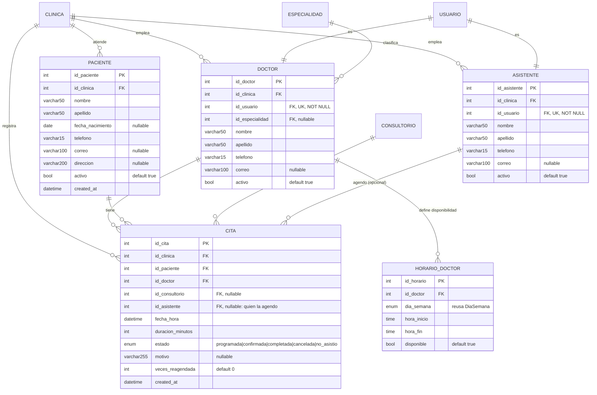
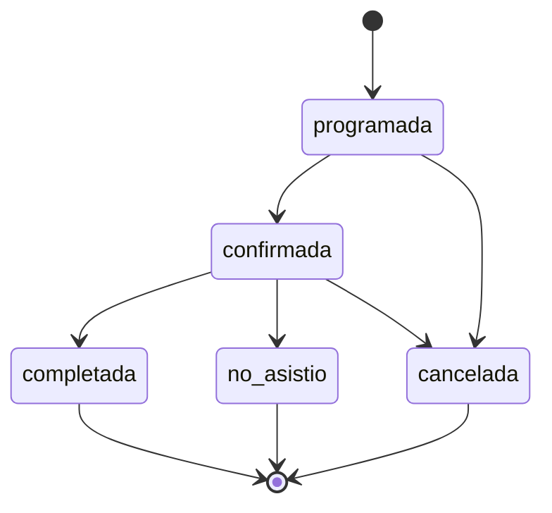

# Diseño: Operación Clínica Básica — Módulo 4

**Fecha:** 2026-08-02
**Estado:** Aprobado para pasar a plan de implementación
**Ticket:** BE-04 · **Asignado:** Meli
**Depende de:** Módulo 1 (Tenancy + Auth core), Módulo 2 (Panel superadministrador) y Módulo 3
(Parámetros por clínica) — los tres implementados y en `main`.

## 1. Contexto

Los Módulos 1 a 3 dejaron listo el andamiaje: `Clinica`, `Usuario`, login con JWT, el aislamiento
por `id_clinica` (`BaseRepository` + `resolve_clinica_id`), el panel del superadmin, y los
parámetros que cada clínica configura para sí misma (`Especialidad`, `Consultorio`, `MetodoPago`,
`HorarioClinica`, `ConfiguracionClinica`).

Hasta acá no existe ninguna entidad de la operación diaria. Este módulo es el primero que la
modela: las personas que la clínica atiende y emplea, y las citas que las vinculan. Es también el
primero que tiene **reglas de negocio de verdad** — hasta ahora todo era CRUD con aislamiento por
clínica; agendar una cita implica validar horarios, disponibilidad, choques y anticipación.

El spec del Módulo 3 dejó explícitamente para acá: `Doctor.id_especialidad` como FK,
`Cita.id_consultorio`, la validación de que una cita caiga dentro del horario de atención, la
duración por defecto tomada de la configuración, las reglas de cambio de cita, y la entidad
`Horario` por doctor.

## 2. Alcance

Dentro de este módulo:

- `Paciente` — ficha de la persona que la clínica atiende, sin login
- `Doctor` — perfil profesional, 1:1 con un `Usuario` de rol `doctor`
- `Asistente` — perfil, 1:1 con un `Usuario` de rol `asistente`
- `HorarioDoctor` — bloques de disponibilidad semanal de cada doctor
- `Cita` — el agendamiento, con su máquina de estados y sus reglas
- `ConfiguracionClinica.anticipacion_minima_reserva_horas` — columna nueva
- `PersonalService` — alta transaccional de `Usuario` + perfil
- `CitaService` + validadores de cita — la lógica de agendamiento
- Endpoints CRUD de los cuatro recursos + horarios por doctor + las tres acciones sobre citas

Fuera de alcance, con su justificación:

| Queda fuera | Por qué |
|---|---|
| `Tratamiento` y la FK `Cita.id_tratamiento` del ERD to-be | `Tratamiento` (`id_doctor`, `descripcion`, `costo`) es catálogo de servicios con precio: pertenece al Módulo 5 (planes de tratamiento) y al 6 (facturación). Agregar la FK ahora significaría crear una tabla que este módulo no usa. Cuando exista, la FK se agrega con una migración de una columna nullable. |
| `HistorialMedico`, odontogramas, diagnósticos, recetas | Módulo 5 completo. Este módulo modela *quién* y *cuándo*, no *qué se le hizo*. |
| `Factura` y todo lo monetario | Módulo 6. |
| Recordatorios y notificaciones de cita | Módulo 8. Este módulo deja el dato (`fecha_hora`, `estado`, correo del paciente) que ese módulo va a leer. |
| Login del paciente | El ERD to-be no cuelga `id_usuario` de `PACIENTE`: el paciente no opera el sistema, lo opera la clínica. Un portal del paciente sería un módulo aparte con su propio modelo de auth. |
| Recurrencia de citas (series semanales, tratamientos de N sesiones) | No está en el legacy ni en el ERD to-be. Cuando aparezca, es una entidad `SerieDeCitas` que genera filas de `Cita`, no un campo en `Cita`. |
| Agregar entradas nuevas a `MODULOS_DISPONIBLES` | Ya existen `pacientes` y `citas` en la lista desde el Módulo 1. No se toca ese archivo compartido. |

## 3. Modelo de datos

Cinco tablas nuevas y una columna nueva. Migración `0004_operacion_clinica.py`
(`down_revision = "0003"`).



Los modelos van en dos archivos: `app/models/personas.py` (`Paciente`, `Doctor`, `Asistente`,
`HorarioDoctor`) y `app/models/cita.py` (`Cita`, `EstadoCita`, `TRANSICIONES_PERMITIDAS`). La
convención del repo es un archivo por entidad o grupo cohesivo; las personas cambian juntas, la
cita tiene su propia máquina de estados y suficiente lógica como para no compartir archivo.

### `EstadoCita` (enum nuevo)

```python
class EstadoCita(str, enum.Enum):
    PROGRAMADA = "programada"
    CONFIRMADA = "confirmada"
    COMPLETADA = "completada"
    CANCELADA = "cancelada"
    NO_ASISTIO = "no_asistio"
```

Se declara con `values_callable=lambda enum_cls: [e.value for e in enum_cls]`, igual que
`EstadoClinica`, `RolUsuario` y `DiaSemana`. Sin eso SQLAlchemy persiste `PROGRAMADA` en vez de
`programada`, y el bug **no se detecta en los tests con SQLite** — solo revienta contra MySQL real
(bug conocido #2 del `CONTEXTO-PROYECTO.md`).

`HorarioDoctor.dia_semana` **reutiliza** el enum `DiaSemana` del Módulo 3. No se crea uno nuevo: es
el mismo concepto, y en MySQL el tipo ENUM se define por columna, así que reutilizar la clase
Python no genera conflicto de nombres en la base.

### Decisiones de modelado y su justificación

| Decisión | Justificación |
|---|---|
| `Paciente` sin `id_usuario` | El ERD to-be no le cuelga uno. El paciente no opera el sistema; lo opera la clínica en su nombre. Agregar auth para pacientes es un módulo aparte con su propio modelo de permisos, no un campo. |
| La edad **no** se almacena; se calcula desde `fecha_nacimiento` | El legacy tenía `Paciente.calcular_edad()` sobre un dato derivado. Guardar la edad la vuelve mentira al día siguiente del cumpleaños. `fecha_nacimiento` es el hecho; la edad es una vista de ese hecho y se expone calculada en el schema de respuesta. |
| `Paciente.correo` como `varchar100`, no `varchar25` | El ERD as-is documenta explícitamente que `varchar25` "trunca correos largos". Es un bug conocido del legacy: copiarlo sería migrar el defecto junto con los datos. |
| `telefono` como `varchar15` en las tres personas, no `char8` | El ERD as-is usa `char8` (formato salvadoreño sin código de país) y el to-be quedó inconsistente (`varchar8` en doctor, `varchar15` en asistente). Se unifica en `varchar15`, que admite código de país. El formato se valida en el schema, no con el ancho de la columna. |
| `Doctor.id_usuario` y `Asistente.id_usuario` **NOT NULL y únicos** | Es lo que dice el ERD to-be (`FK,UK`) y es lo que hace la relación 1:1 real. Un doctor sin usuario no podría entrar al sistema y sería un registro fantasma; un usuario con dos perfiles rompería `get_doctor_actual`. La unicidad se aplica en la base, no solo en código. |
| `Doctor.id_especialidad` **nullable** | Una clínica recién creada no tiene el catálogo de especialidades cargado (el Módulo 3 no siembra ninguna). Exigirla haría que dar de alta al primer doctor dependa de haber configurado el catálogo antes. Se valida que, cuando venga, sea una especialidad activa de la misma clínica. |
| `Doctor.id_especialidad` como FK y no como `varchar50` | Es exactamente lo que el Módulo 3 dejó preparado. El ERD as-is guardaba texto libre, lo que impide filtrar doctores por especialidad de forma confiable ("Ortodoncia" vs "ortodoncia" vs "Ortodonsia"). |
| `HorarioDoctor` con PK propia, **no** compuesta `(id_doctor, dia_semana)` como `HorarioClinica` | Un doctor tiene varios bloques en el mismo día: atiende de 08:00 a 12:00, almuerza, y vuelve de 14:00 a 18:00. Con llave compuesta eso es imposible de representar. La clínica, en cambio, abre y cierra una vez por día, y ahí la llave compuesta era la restricción correcta. Unicidad `(id_doctor, dia_semana, hora_inicio)`. |
| `HorarioDoctor` cuelga de `Doctor` y no lleva `id_clinica` propio | La clínica se deduce por el doctor. Duplicar `id_clinica` abriría la posibilidad de que las dos columnas se contradigan. El aislamiento se garantiza en el repositorio con un join contra `Doctor`. |
| `HorarioDoctor.disponible: bool` | Permite bloquear un rango sin borrarlo (vacaciones, licencia) y volver a habilitarlo. Mismo espíritu que `HorarioClinica.cerrado`. |
| `Cita.duracion_minutos` se **guarda** en la fila, no se lee de `ConfiguracionClinica` al mostrarla | Es una foto del momento en que se agendó. Si mañana la clínica cambia la duración por defecto de 30 a 45 minutos, las citas ya agendadas no deben estirarse solas ni empezar a chocar entre sí retroactivamente. La configuración aporta el **default** al crear; una vez creada, la cita es dueña de su duración. |
| `Cita.id_consultorio` **nullable**, pero con validación de choque cuando viene | Una clínica de un solo sillón no lo carga, y exigirlo la obligaría a inventar un consultorio ficticio. Si lo carga, el sistema garantiza que no haya dos citas solapadas en la misma sala. |
| `Cita.id_asistente` nullable | Registra quién agendó la cita, para auditoría. Es nullable porque un `admin` (que no tiene fila en `Asistente`) también puede agendar. |
| `Cita.id_clinica` explícito, aunque sea derivable del paciente o del doctor | Todos los repositorios de recursos por clínica filtran por `id_clinica` directo, según la regla dura del Módulo 1. Derivarlo con un join en cada consulta de agenda sería más lento y, sobre todo, haría que el filtro de aislamiento dependa de la corrección de otro join. Los validadores garantizan que paciente, doctor y consultorio pertenezcan a esa misma clínica. |
| `Cita.veces_reagendada: int` en vez de un estado `reagendada` | Reagendar es una transición, no una situación. Un estado `reagendada` no responde "¿está confirmada o no?", se pierde igual el día de la cita (hay que marcarla `completada` o `no_asistio`), y obligaría a acordarse de incluirlo en cada filtro de agenda activa. El contador guarda el dato sin ensuciar la máquina de estados y habilita un tope futuro. |
| Reagendar **mueve la fila**, no cancela y crea otra | Una cita del mundo real que se corre de día sigue siendo la misma cita. Cancelar y crear duplicaría filas, llenaría el historial del paciente de cancelaciones que nunca fueron cancelaciones, y en el Módulo 5 obligaría a decidir a cuál de las dos filas se le cuelga el expediente. |
| Al reagendar, el estado **baja** a `programada` | La confirmación del paciente era para la hora vieja. Mantenerla como `confirmada` afirmaría algo que nadie confirmó. |
| Sin `updated_at` en `Cita` | No hay ningún consumidor de ese dato en este módulo ni en los siguientes del roadmap. Los cambios que importan (estado, reagendamiento) ya quedan registrados en `estado` y `veces_reagendada`. Un log de auditoría completo, si se necesita, es una tabla aparte. |

### Columna nueva en `ConfiguracionClinica`

`anticipacion_minima_reserva_horas: int`, default `24`, rango `1`–`720`.

Gobierna con cuánta anticipación mínima se puede **crear** una cita nueva. Con 24, la cita más
cercana que se puede agendar es dentro de 24 horas.

El mínimo es `1` y no `0`, igual que `horas_minimas_cambio_cita` y `dias_minimos_reagendamiento`:
la regla es configurable en intensidad pero no desactivable. Una clínica que quiera poder atender
urgencias el mismo día la baja a 2 o 3 horas; ninguna puede agendar para "ahora mismo" ni para el
pasado. El default de 24 refleja la práctica de las clínicas dentales salvadoreñas, donde no se
atiende sin cita previa.

**Sobre el hueco que dejó el Módulo 3, y qué hace y qué no hace este parámetro.** El hueco era:
un paciente cancela con 24 h de anticipación y reserva una cita nueva para mañana, esquivando la
regla de los 3 días de reagendamiento. Este parámetro **angosta** el hueco pero **no lo cierra**:
con 24 h de anticipación mínima, la reserva nueva para mañana sigue siendo posible. Cerrarlo con
este parámetro exigiría subirlo a 72 h, lo que castigaría a todo paciente nuevo y no solo al que
esquiva.

Se decide dejarlo así, por dos razones. Primero, el parámetro se justifica solo con
independencia del hueco: impedir que se agende para el pasado o para dentro de cinco minutos es
valioso por sí mismo. Segundo, la regla que sí cerraría el hueco ("si el paciente canceló hace
poco, aplicarle `dias_minimos_reagendamiento` a su próxima reserva") acopla la creación de una
cita al historial de cancelaciones del paciente: un acoplamiento temporal escondido, donde el
resultado de una operación depende de algo que no está en el request. Se agrega cuando el negocio
confirme que el esquive ocurre en la práctica, y gracias al diseño de validadores de la sección 5
será **un archivo nuevo agregado a una lista**, sin tocar `CitaService` ni sus tests.

## 4. Arquitectura de repositorios y servicios

### Repositorios que heredan de `BaseRepository`

`PacienteRepository`, `DoctorRepository`, `AsistenteRepository` y `CitaRepository`. Son
exactamente el caso para el que se diseñó: recursos que viven dentro de una clínica, con
`id_clinica` como primer parámetro obligatorio sin default.

Los tres primeros implementan CRUD con borrado lógico (`activo = False`). `PacienteRepository`
agrega `listar(id_clinica, buscar: str | None = None, incluir_inactivos: bool = False)`: el filtro
por nombre o apellido se resuelve en SQL con `func.lower()` explícito, por el mismo motivo que en
el Módulo 3 (SQLite es case-sensitive por defecto, MySQL con `utf8mb4_general_ci` no).

`CitaRepository` agrega, además del CRUD:

```python
def listar_por_rango(
    self,
    id_clinica: int,
    desde: datetime | None = None,
    hasta: datetime | None = None,
    id_doctor: int | None = None,
    id_paciente: int | None = None,
    estado: EstadoCita | None = None,
) -> list[Cita]: ...

def hay_solapamiento_de_doctor(
    self, id_clinica: int, id_doctor: int,
    inicio: datetime, fin: datetime, excluir_id_cita: int | None = None,
) -> bool: ...

def hay_solapamiento_de_consultorio(
    self, id_clinica: int, id_consultorio: int,
    inicio: datetime, fin: datetime, excluir_id_cita: int | None = None,
) -> bool: ...
```

El solapamiento es la condición clásica `inicio_a < fin_b AND inicio_b < fin_a`, y considera solo
citas en estado `programada` o `confirmada` — una cita cancelada libera el espacio. Va en el
repositorio y no en el validador porque es una **consulta**, no una regla: el validador decide qué
hacer con la respuesta.

`excluir_id_cita` existe para el reagendamiento: sin él, una cita chocaría contra sí misma al
verificar su horario nuevo.

### `HorarioDoctorRepository` (**no** hereda de `BaseRepository`)

Tercera excepción documentada, con el mismo criterio que `HorarioClinicaRepository` y
`ConfiguracionClinicaRepository`: es un recurso **anidado** bajo doctor, no un recurso de primer
nivel de la clínica. Su identidad es `(id_clinica, id_doctor)` más el propio horario, no un `int`
simple como asume la firma de `BaseRepository`.

```python
def listar_de_doctor(self, id_clinica: int, id_doctor: int) -> list[HorarioDoctor]: ...
def reemplazar_de_doctor(self, id_clinica: int, id_doctor: int, bloques: list[dict]) -> list[HorarioDoctor]: ...
```

Igual exige `id_clinica` como primer parámetro y lo aplica con un join contra `Doctor`: pedir los
horarios de un `id_doctor` de otra clínica devuelve lista vacía, nunca los horarios ajenos.
`reemplazar_de_doctor` borra los bloques existentes y escribe los nuevos, validando todos antes de
escribir ninguno — mismo criterio que `PUT /horarios` del Módulo 3.

### Por qué **no** hay un `PersonalRepository[T]` compartido entre `Doctor` y `Asistente`

Los dos modelos se parecen (`nombre`, `apellido`, `telefono`, `correo`, `activo`, `id_usuario`), y
la tentación de abstraer es real. Se decide no hacerlo.

El Módulo 3 justificó `CatalogoRepository` con **tres** casos idénticos y presentes, no con dos
parecidos. Acá hay dos, y `Doctor` ya diverge: tiene `id_especialidad`, tiene horarios colgando, y
es el que aparece en las citas y en `get_doctor_actual`. Una clase base compartida tendría que
crecer con excepciones para el doctor casi de inmediato, y en el Módulo 5 (donde el doctor gana
tratamientos y el asistente no gana nada) la grieta se ensancharía. La duplicación real son unos
30 renglones de CRUD que ya están cubiertos por la forma de `BaseRepository`.

La abstracción que **sí** se comparte es la que ya existe: ambos heredan `BaseRepository` y ambos
se dan de alta por `PersonalService`, donde el código compartido es el que de verdad importa (la
transacción `Usuario` + perfil).

### `PersonalService`

Alta transaccional de un miembro del personal. Copia el patrón de
`ClinicaService.crear_clinica_con_admin` del Módulo 2: `try` / `except` con `db.rollback()`
explícito.

```python
def crear_doctor(self, id_clinica: int, datos: dict) -> dict: ...
def crear_asistente(self, id_clinica: int, datos: dict) -> dict: ...
```

Cada uno, en una sola transacción:

1. Verifica que el `username` no exista (`UsernameYaExisteError` → 409).
2. Si vino `id_especialidad`, verifica que sea una especialidad activa de esa clínica
   (`ReferenciaInvalidaError` → 422).
3. Crea el `Usuario` con `rol=doctor` / `rol=asistente`, `id_clinica`, `debe_cambiar_password=True`
   y una password generada con `generar_password_temporal()`.
4. Crea la fila `Doctor` / `Asistente` apuntando a ese `id_usuario`.
5. Devuelve el perfil **más la password temporal**, que se muestra una sola vez — mismo flujo que
   `POST /clinicas` del Módulo 2.

Se decide crear el `Usuario` desde el mismo endpoint en vez de exigir que exista de antes porque la
alternativa obliga a un flujo de dos pasos en dos pantallas distintas, con la posibilidad de dejar
usuarios huérfanos sin perfil si el segundo paso falla. La transacción única lo hace imposible.

Dar de baja un doctor o asistente (`DELETE`) pone `activo = False` en el perfil **y**
`Usuario.activo = False`, también en una transacción: un profesional dado de baja no debe poder
seguir entrando al sistema. La operación inversa (`PUT` con `activo: true`) reactiva ambos.

### `CitaService`

Concentra toda la lógica de agendamiento. Ninguna ruta valida una cita por su cuenta.

```python
def crear(self, id_clinica: int, datos: dict, id_asistente: int | None) -> Cita: ...
def cambiar_estado(self, id_clinica: int, id_cita: int, nuevo: EstadoCita) -> Cita: ...
def cancelar(self, id_clinica: int, id_cita: int) -> Cita: ...
def reagendar(self, id_clinica: int, id_cita: int, fecha_hora: datetime,
              id_consultorio: int | None) -> Cita: ...
```

`crear` toma la `duracion_minutos` del request si vino, y si no de
`ConfiguracionClinica.duracion_cita_minutos`. Después arma el `ContextoCita` y corre los
validadores.

## 5. Reglas de la cita

### Los validadores

En `app/services/validadores_cita.py`. Cada regla es un objeto pequeño e independiente con la
misma interfaz:

```python
@dataclass(frozen=True)
class ContextoCita:
    id_clinica: int
    id_paciente: int
    id_doctor: int
    id_consultorio: int | None
    fecha_hora: datetime
    duracion_minutos: int
    configuracion: ConfiguracionClinica
    ahora: datetime
    excluir_id_cita: int | None = None

    @property
    def fin(self) -> datetime: ...


class ValidadorDeCita(Protocol):
    def validar(self, ctx: ContextoCita) -> None:
        """Lanza una excepcion de dominio si la cita no es valida."""
```

Los siete validadores, en el orden en que se ejecutan:

| # | Validador | Qué comprueba | Lanza |
|---|---|---|---|
| 1 | `ReferenciasDeLaMismaClinica` | Paciente, doctor y (si vino) consultorio existen, están activos y pertenecen a esta clínica | `ReferenciaInvalidaError` → 422 |
| 2 | `NoEnElPasado` | `fecha_hora > ahora` | `CitaEnElPasadoError` → 422 |
| 3 | `AnticipacionMinima` | `fecha_hora >= ahora + anticipacion_minima_reserva_horas` | `AnticipacionInsuficienteError` → 422 |
| 4 | `DentroDelHorarioDeLaClinica` | Inicio **y fin** caen dentro del horario del día, y el día no está cerrado. Si el día no tiene fila, usa `HORARIO_POR_DEFECTO` | `FueraDeHorarioClinicaError` → 422 |
| 5 | `DentroDelHorarioDelDoctor` | Inicio y fin caen dentro de **un mismo** bloque con `disponible = True`. Un doctor sin ningún bloque cargado se considera no disponible | `DoctorNoDisponibleError` → 422 |
| 6 | `SinChoqueDeDoctor` | No hay solapamiento con otra cita `programada` o `confirmada` del mismo doctor | `ChoqueDeCitaError` → 409 |
| 7 | `SinChoqueDeConsultorio` | Ídem para el consultorio. Se saltea si `id_consultorio is None` | `ChoqueDeCitaError` → 409 |

`CitaService` los recorre en orden y **corta en el primero que falla**: no tiene sentido chequear
solapamientos si el paciente no existe, y el mensaje de error más útil es el de la primera regla
violada, no una lista de siete.

Tres consecuencias de este diseño que vale la pena hacer explícitas:

- **Cada regla se testea sin base de datos y sin servicio.** Se arma un `ContextoCita` a mano y se
  llama a `validar`. Los validadores que necesitan consultar (1, 5, 6, 7) reciben el repositorio
  que necesitan en su constructor, así que en el test se les pasa un doble.
- **Agregar una regla es un archivo nuevo y un renglón en la lista**, no editar `CitaService`. Es
  el mismo criterio con el que el Módulo 3 justificó `MetodoPago` como tabla en vez de columnas
  booleanas: extender el sistema debe ser dato o composición, no modificación (OCP).
- **`excluir_id_cita` hace que los mismos siete validadores sirvan para crear y para reagendar.**
  Al reagendar se pasa el id de la propia cita, que queda fuera del chequeo de solapamiento; de lo
  contrario la cita chocaría contra sí misma.

El costo aceptado: un archivo más y una interfaz que hay que entender antes de tocar el módulo. Con
siete reglas ya presentes y más previstas en los Módulos 5 y 8, se paga sola frente a la
alternativa (siete `if` encadenados dentro de `CitaService.crear`, que es el god method que este
proyecto está reescribiendo desde el legacy).

### Máquina de estados



Las transiciones permitidas viven en un diccionario junto al enum, en `app/models/cita.py`:

```python
TRANSICIONES_PERMITIDAS: dict[EstadoCita, set[EstadoCita]] = {
    EstadoCita.PROGRAMADA: {EstadoCita.CONFIRMADA, EstadoCita.CANCELADA},
    EstadoCita.CONFIRMADA: {EstadoCita.COMPLETADA, EstadoCita.NO_ASISTIO, EstadoCita.CANCELADA},
    EstadoCita.COMPLETADA: set(),
    EstadoCita.CANCELADA: set(),
    EstadoCita.NO_ASISTIO: set(),
}
```

Una sola tabla en vez de condicionales repartidos: agregar un estado es una entrada en el
diccionario, y el conjunto vacío expresa "terminal" sin necesitar un `if` especial. Cualquier
transición no listada lanza `TransicionInvalidaError` → 409.

Se decide que solo se pueda `completar` o marcar `no_asistio` desde `confirmada`, no desde
`programada`: una cita que el paciente nunca confirmó y a la que no vino es información distinta de
una que confirmó y no honró, y el flujo de la clínica (llamar el día anterior a confirmar) hace que
`programada → confirmada` sea un paso real y no burocracia.

### Cancelar y reagendar

Son endpoints propios y no un `PATCH /estado` genérico, porque tienen reglas que las demás
transiciones no tienen y porque reagendar además cambia datos, no solo el estado.

**Cancelar** exige que falten al menos `horas_minimas_cambio_cita` para `fecha_hora`. Si no,
`AnticipacionInsuficienteError` → 422. Deja el estado en `cancelada`.

**Reagendar** exige, en este orden:

1. Que la cita esté en `programada` o `confirmada` (`TransicionInvalidaError` → 409).
2. Que falten al menos `horas_minimas_cambio_cita` respecto de la cita **vigente** — mide con
   cuánta anticipación avisás.
3. Que la fecha **nueva** esté a `dias_minimos_reagendamiento` días o más de hoy — mide para cuándo
   la movés. Son dos reglas distintas con unidades distintas, tal como las justificó el Módulo 3.
4. Los siete validadores contra la fecha nueva, con `excluir_id_cita` puesto.

Si todo pasa: actualiza `fecha_hora` y `id_consultorio`, incrementa `veces_reagendada` y pone
`estado = programada`.

## 6. Endpoints

Todos resuelven la clínica con `id_clinica: int = Depends(resolve_clinica_id)`. Ninguno recibe
`id_clinica` por URL ni por body, igual que en el Módulo 3.

### Personas

| Método y ruta | Éxito | Errores |
|---|---|---|
| `GET /pacientes?buscar=&incluir_inactivos=false` | `200` lista | `401`, `403` |
| `POST /pacientes` | `201` | `422` |
| `GET /pacientes/{id}` | `200` | `404` |
| `PUT /pacientes/{id}` | `200` | `404`, `422` |
| `DELETE /pacientes/{id}` | `204` (`activo = False`) | `404` |
| `GET /doctores?id_especialidad=&incluir_inactivos=false` | `200` lista | `401`, `403` |
| `POST /doctores` | `201` perfil **+ `password_temporal`** | `409` username duplicado, `422` |
| `GET /doctores/{id}` · `PUT` · `DELETE` | `200` / `200` / `204` | `404`, `409`, `422` |
| `GET /asistentes` · `POST` · `GET /{id}` · `PUT` · `DELETE` | Ídem doctores, sin filtro de especialidad | Ídem |
| `GET /doctores/{id}/horarios` | `200` — bloques del doctor, ordenados lunes→domingo y por hora | `404` |
| `PUT /doctores/{id}/horarios` | `200` — reemplaza todos los bloques | `404`, `422` |

`GET /pacientes/{id}` devuelve `edad` calculada desde `fecha_nacimiento`, o `null` si no se cargó.

`PUT /doctores/{id}/horarios` reemplaza el conjunto completo de bloques en un solo request, por el
mismo motivo que `PUT /horarios` del Módulo 3: una agenda semanal se edita y se valida como una
unidad, y así no puede quedar en un estado intermedio (un bloque movido y el que le sigue no,
solapándose). Valida que dentro de un mismo día los bloques no se solapen y que
`hora_fin > hora_inicio`; lanza `HorarioInvalidoError` → 422, reutilizando la excepción del
Módulo 3.

### Citas

| Método y ruta | Comportamiento |
|---|---|
| `GET /citas?desde=&hasta=&id_doctor=&id_paciente=&estado=` | `200` lista. Para el rol `doctor`, el filtro `id_doctor` se **fuerza** a su propio id |
| `POST /citas` | `201`. `duracion_minutos` opcional; si falta, sale de la configuración. `id_asistente` se toma del usuario autenticado si es asistente, nunca del body |
| `GET /citas/{id}` | `200`, `404` |
| `PATCH /citas/{id}/estado` | `200`. Body `{"estado": "confirmada"}`. `409` si la transición no está permitida |
| `PATCH /citas/{id}/cancelar` | `200`. `409` si la transición no está permitida, `422` si no hay anticipación suficiente |
| `PATCH /citas/{id}/reagendar` | `200`. Body `{"fecha_hora": ..., "id_consultorio": ...}`. `409` / `422` según la regla que falle |

No hay `DELETE /citas`: una cita no se borra, se cancela. Borrarla perdería el registro de que
existió, que es justamente lo que la clínica necesita para el historial del paciente y para las
métricas del Módulo 7.

### Matriz de permisos

| Recurso | Leer | Crear / editar | Dar de baja |
|---|---|---|---|
| Pacientes | los 4 roles | superadmin, admin, asistente, doctor | superadmin, admin |
| Doctores | los 4 roles | superadmin, admin | superadmin, admin |
| Asistentes | los 4 roles | superadmin, admin | superadmin, admin |
| Horario de un doctor | los 4 roles | superadmin, admin, y **el propio doctor sobre el suyo** | — |
| Citas | superadmin, admin, asistente: todas. **Doctor: solo las suyas** | superadmin, admin, asistente | — (se cancela) |
| Estado de una cita | — | superadmin, admin, asistente, y **el doctor de esa cita** | — |

**Este módulo rompe la regla única del Módulo 3** ("los 4 roles leen, solo admin y superadmin
escriben"), y es deliberado. Aquel módulo era configuración de la clínica, que se toca una vez y la
define quien administra. Esto es la operación diaria: una asistente que no puede registrar un
paciente ni agendar una cita no puede hacer su trabajo, y un doctor que no puede marcar una cita
como completada obligaría a que un admin cierre cada consulta del día. La regla que reemplaza a la
anterior es igual de enunciable: **quien ejecuta la operación en el mundo real puede registrarla en
el sistema; quien administra la clínica define quién trabaja en ella.**

**El filtro del doctor sobre las citas no es un `403`, es un `WHERE`.** `GET /citas` le inyecta
`id_doctor = <el suyo>` a la consulta, y `GET /citas/{id}` de una cita ajena devuelve `404`, no
`403`. Un `403` le confirmaría que esa cita existe, que ya es información sobre un paciente que no
atiende. Es el mismo criterio con el que `obtener` devuelve `None` para un recurso de otra clínica.

Esto requiere una dependencia nueva en `app/api/deps.py`:

```python
def get_doctor_actual(
    usuario: Usuario = Depends(get_current_user), db: Session = Depends(get_db)
) -> Doctor | None:
    """Traduce el Usuario del JWT a su fila Doctor. None si no es doctor."""
```

Es el único archivo de los Módulos 1 a 3 que este módulo modifica. No se toca `ClinicaService`,
`AuthService`, `MODULOS_DISPONIBLES` ni ninguna migración ya aplicada.

## 7. Validación

En `app/schemas/personas.py` y `app/schemas/cita.py`.

- `nombre` y `apellido`: obligatorios, `min_length=1` tras `strip()`, `max_length=50`.
- `telefono`: obligatorio, 8 a 15 caracteres, solo dígitos, `+`, espacios y guiones. La
  normalización (quitar espacios y guiones antes de guardar) se hace en el validador del schema.
- `correo`: opcional, `EmailStr` (con `email-validator`, no regex propia), `max_length=100`.
- `fecha_nacimiento`: opcional, no puede ser futura ni anterior a 120 años atrás.
- `direccion`: opcional, `max_length=200`.
- `username` (alta de doctor/asistente): obligatorio, 3 a 30 caracteres, mismo criterio que el
  Módulo 2.
- `id_especialidad`: opcional, entero positivo. Que exista y sea de la clínica lo valida el
  servicio, no el schema — el schema no tiene acceso a la base.
- Bloque de horario: `hora_fin > hora_inicio`; dentro de un mismo día los bloques no se solapan.
- `Cita.fecha_hora`: obligatoria, `datetime`. Las reglas de negocio (pasado, anticipación, horario)
  las aplican los validadores, no el schema: dependen de la configuración de la clínica y de la
  base.
- `Cita.duracion_minutos`: opcional en el request, `5 <= n <= 480` cuando viene (mismo rango que
  `duracion_cita_minutos` del Módulo 3).
- `Cita.motivo`: opcional, `max_length=255`.
- `anticipacion_minima_reserva_horas`: entero `1 <= n <= 720`.

Los schemas de lectura y escritura son distintos por recurso (`PacienteCreate`, `PacienteUpdate`,
`PacienteResponse`, etc.), con todos los campos opcionales en los `Update` para permitir
actualización parcial. `DoctorCreateResponse` y `AsistenteCreateResponse` son schemas aparte: son
los únicos dos que exponen `password_temporal`, y solo en la respuesta del `POST`. Ni el `GET` de
detalle ni el listado lo devuelven nunca.

## 8. Errores

Excepciones nuevas en `app/exceptions.py`, junto a las que ya existen:

```python
class ReferenciaInvalidaError(Exception):
    """Una FK apunta a algo que no existe, esta inactivo, o es de otra clinica."""


class CitaEnElPasadoError(Exception):
    """La fecha y hora de la cita ya paso."""


class AnticipacionInsuficienteError(Exception):
    """No se respeta la anticipacion minima configurada por la clinica."""


class FueraDeHorarioClinicaError(Exception):
    """La cita no cae dentro del horario de atencion de la clinica."""


class DoctorNoDisponibleError(Exception):
    """El doctor no tiene un bloque disponible que cubra ese horario."""


class ChoqueDeCitaError(Exception):
    """Ya hay una cita solapada para ese doctor o ese consultorio."""


class TransicionInvalidaError(Exception):
    """El estado actual de la cita no admite esa transicion."""
```

No se declara una excepción del tipo "ese usuario ya tiene un perfil": como `PersonalService` crea
el `Usuario` y el perfil en la misma transacción, no existe ningún camino por el cual se intente
ligar un perfil a un usuario que ya tiene otro. La unicidad de `id_usuario` en la base es la red de
seguridad, no un caso de negocio a manejar. Si alguna vez se agrega un flujo de "vincular a un
usuario existente", esa excepción nace con él.

Se reutilizan `UsernameYaExisteError` (Módulo 1) y `HorarioInvalidoError` (Módulo 3): son
exactamente el mismo error de negocio y crear duplicados con otro nombre solo obligaría a atrapar
dos excepciones donde hoy se atrapa una.

Traducción a HTTP en las rutas: los conflictos con el estado del sistema van a `409`
(`ChoqueDeCitaError`, `TransicionInvalidaError`, `UsernameYaExisteError`,
`UsuarioYaTienePerfilError`); las violaciones de una regla sobre los datos enviados van a `422`
(el resto). Ningún `HTTPException` aparece en repositorios, servicios, validadores ni modelos.

## 9. Plan de pruebas

TDD: test primero (RED, fallando por la razón correcta), después la implementación mínima (GREEN).
Todo corre contra SQLite en memoria con las fixtures `db_session` y `client` de
`tests/conftest.py`. Un archivo de test por módulo de `app/`.

| Archivo | Qué cubre |
|---|---|
| `test_personas_models.py` | Columnas y defaults de las 4 tablas; unicidad de `id_usuario`; `HorarioDoctor` admite varios bloques el mismo día; `id_especialidad` acepta `NULL` |
| `test_cita_model.py` | `EstadoCita` serializa por `.value` (no por `.name`); `TRANSICIONES_PERMITIDAS` cubre los 5 estados y los 3 terminales tienen conjunto vacío; defaults de `veces_reagendada` |
| `test_paciente_repository.py` | Aislamiento entre clínicas, búsqueda por nombre y apellido case-insensitive, borrado lógico, `incluir_inactivos`, actualización parcial |
| `test_doctor_repository.py` | Ídem + filtro por especialidad |
| `test_asistente_repository.py` | Ídem, sin especialidad |
| `test_horario_doctor_repository.py` | Reemplazo del conjunto de bloques, varios bloques el mismo día, orden lunes→domingo y por hora, y que pedir los horarios de un doctor de otra clínica devuelva lista vacía |
| `test_cita_repository.py` | `listar_por_rango` con cada combinación de filtros; los dos métodos de solapamiento, incluyendo bordes (una cita que arranca justo cuando termina la otra **no** choca), `excluir_id_cita`, y que una cita cancelada no cuente como choque |
| `test_validadores_cita.py` | **Uno por validador, sin base de datos**: contexto armado a mano y dobles para los repositorios. Incluye los casos borde de cada regla |
| `test_cita_service.py` | Que los validadores corran en orden y se corte en el primero que falla; que la duración salga de la configuración cuando no viene en el request; las tres acciones (`cambiar_estado`, `cancelar`, `reagendar`) con sus reglas propias; que reagendar incremente el contador y baje el estado |
| `test_personal_service.py` | Alta transaccional: se crean `Usuario` y perfil juntos; si el perfil falla, **no queda el usuario huérfano** (rollback); password temporal generada y `debe_cambiar_password=True`; la baja desactiva perfil y usuario |
| `test_pacientes_routes.py` | Los 5 endpoints, matriz de permisos, `X-Clinica-Id` del superadmin, `404` con id de otra clínica, `edad` calculada |
| `test_doctores_routes.py` | Ídem + `password_temporal` en el `201` + los endpoints de horarios + que un doctor pueda editar su propio horario pero no el de otro |
| `test_asistentes_routes.py` | Ídem doctores, sin horarios |
| `test_citas_routes.py` | Los 6 endpoints; **que un doctor solo vea sus citas en el listado y reciba `404` (no `403`) al pedir una ajena por id**; los códigos `409` vs `422` de cada regla; que `id_asistente` se tome del token y no del body |
| `test_configuracion_routes.py` | (modificar) el default y el rango de `anticipacion_minima_reserva_horas` |

Los tests de mayor valor, y los que no pueden faltar:

1. **Un admin de la clínica A no puede leer, editar ni dar de baja ningún recurso de la clínica B** —
   ni por id directo, ni mandando `X-Clinica-Id` (que para roles no-superadmin se ignora por
   diseño). Aplica a los cuatro recursos.
2. **Una cita no puede referenciar entidades de otra clínica.** Un `POST /citas` con un
   `id_paciente` de la clínica B desde la clínica A devuelve `422`, no crea nada, y no filtra en el
   mensaje si ese paciente existe.
3. **El rollback de `PersonalService`.** Si la creación del perfil falla después de haber creado el
   `Usuario`, no queda ningún usuario huérfano en la base.

Al cerrar el módulo, correr además la suite completa contra MySQL real en Docker (comandos en
`CONTEXTO-PROYECTO.md`, sección 9). `EstadoCita` es exactamente el tipo de enum que pasa en SQLite
y falla en MySQL, y las columnas `DateTime` con comparaciones de rango se comportan distinto entre
los dos motores.

**Y una colección de Postman propia del módulo**, `ClinicaDentalWeb-Modulo4.postman_collection.json`,
en `docs/postman/`. Un archivo nuevo, no una edición del que dejó el Módulo 3: cada módulo tiene su
colección igual que tiene su spec y su plan, así se puede verificar uno sin arrastrar los demás.
Ejecutable de punta a punta con **Run Collection**, con `pm.test(...)` en cada request y las
variables encadenadas (tokens, `id_clinica`, ids creados). Cubre el camino feliz, las siete reglas
de agendamiento con su código de error, el aislamiento entre clínicas y la matriz de permisos.

No reemplaza a `pytest`: es lo que corre contra **MySQL real y sobre HTTP de verdad**, donde los
tests con SQLite no llegan — serialización de `datetime` y de los enums, y el flujo completo de
password temporal (crear doctor, loguearse con la temporal, ver `debe_cambiar_password` en `true`).

## 10. Qué habilita este módulo

- **Módulo 5 (Expediente clínico avanzado):** `HistorialMedico.id_paciente`, los odontogramas y
  planes de tratamiento colgando de `Paciente`, y `Tratamiento.id_doctor`. La FK
  `Cita.id_tratamiento` se agrega ahí con una migración de una columna.
- **Módulo 6 (Facturación):** `Factura.id_paciente` y `Factura.id_asistente`, y la relación entre
  las citas completadas y lo que se factura.
- **Módulo 7 (Dashboards):** citas por estado, por doctor y por rango de fechas — `listar_por_rango`
  ya devuelve todo lo que esas métricas necesitan.
- **Módulo 8 (Notificaciones):** los recordatorios se disparan sobre `Cita.fecha_hora` para las
  citas en estado `programada` o `confirmada`, con el correo y el teléfono del paciente.
- **Módulos siguientes en general:** el patrón de validadores independientes para cualquier
  operación con varias reglas de negocio, y `PersonalService` como segundo ejemplo (después de
  `ClinicaService`) de alta transaccional de entidades relacionadas.

## 11. Deuda conocida, decidida a conciencia

- **El hueco de reagendamiento del Módulo 3 sigue abierto.** Ver la justificación completa en la
  sección 3. Cerrarlo es agregar un validador a la lista, sin tocar `CitaService`.
- **No hay `logging`.** El `Plannig` de Notion lista "reemplazar `print()` por logging" como
  pendiente transversal para los Módulos 4+. Este módulo no agrega `print()`, pero tampoco
  introduce logging estructurado: hacerlo bien implica configurarlo en `main.py` y decidir formato
  y niveles para todo el proyecto, lo cual afecta código de Christian. Queda como tarea
  transversal aparte.
- **No hay forma de regenerar una password temporal, y este módulo lo hace visible.** Las passwords
  temporales se devuelven una sola vez en la respuesta del `POST`; si el doctor la pierde antes de
  cambiarla, hoy la única salida es un `UPDATE` manual contra MySQL. El hueco **no lo crea este
  módulo**: existe desde el Módulo 2 para el admin de clínica. Se deja fuera del alcance a
  propósito, porque el arreglo correcto cubre a los cuatro roles con un endpoint bajo `/usuarios`,
  no solo a doctores y asistentes — resolverlo a medias dejaría tres formas de crear usuarios y dos
  de recuperarlos. Queda como ticket propio en Notion:
  [BE-09 — Recuperación de credenciales](https://app.notion.com/p/3b0a9ad7882681f7a53ec475508452ff),
  sugerido para Christian por ser territorio de auth. No bloquea a este módulo: sin él se pueden
  crear doctores, asistentes, pacientes y citas, y todo funciona.
- **No está definido qué significa una referencia a algo dado de baja, y el Módulo 5 lo va a heredar
  multiplicado.** Este es el hueco más importante que queda abierto, y salió de la revisión final del
  módulo.

  El borrado lógico se implementó como "poner `activo = False`", pero **ninguna baja consulta si la
  entidad está en uso**, y los validadores tratan una referencia inactiva igual que una inexistente.
  Tres consecuencias verificadas:

  1. **Dar de baja un doctor no toca sus citas futuras.** Quedan visibles en la agenda, siguen
     ocupando su horario para la detección de choques (`_solapadas` filtra por estado, no por doctor
     activo), y **no se pueden reagendar** — solo cancelar, porque `cancelar` no corre los
     validadores. El doctor tampoco puede entrar al sistema.
  2. **Desactivar un consultorio del Módulo 3 vuelve no-reagendable a cualquier cita que lo use.**
     `reagendar` hereda el `id_consultorio` de la cita cuando el body no manda otro, así que la
     validación falla por una sala que alguien desactivó, y el usuario no tiene forma de saber que el
     arreglo es mandar un consultorio distinto.
  3. **Desactivar una especialidad bloquea el `PUT` completo de los doctores que la tienen.** Un
     cliente que lea un doctor con `GET` y reenvíe el objeto entero —el patrón normal— no puede
     corregirle el teléfono sin cambiarle la especialidad.

  Lo único que se corrigió por ahora es el síntoma más engañoso: los mensajes de
  `ReferenciasDeLaMismaClinica` ahora distinguen `"el doctor no existe en esta clinica"` de `"el
  doctor esta dado de baja"`, que son problemas distintos con arreglos distintos.

  **La política de fondo queda por decidir**, y son tres caminos con costos distintos:

  | Opción | Qué implica | Costo |
  |---|---|---|
  | **Bloquear la baja si hay referencias activas** | `DELETE /doctores/{id}` devuelve `409` si el doctor tiene citas en `programada` o `confirmada`. Igual para consultorios y especialidades en uso. | La clínica tiene que resolver las citas antes de dar de baja a alguien, lo cual es más trabajo pero refleja la realidad: un profesional que se va deja pacientes que hay que reasignar. |
  | **Cancelar en cascada** | Dar de baja un doctor cancela automáticamente sus citas futuras. | Simple de implementar, pero cancela citas sin avisarle a nadie, y las reglas de anticipación existen justamente para que eso no pase en silencio. |
  | **Aceptar referencias inactivas en citas preexistentes** | Los validadores permiten un doctor o consultorio inactivo cuando la cita **ya existía**, y solo lo rechazan al crear una nueva. | Menos fricción, pero introduce dos niveles de validez ("válido para crear" vs. "válido para mantener") que hay que sostener en todo el sistema de ahí en adelante. |

  Recomendación para cuando se decida: la primera. Es la que no toma decisiones en nombre de la
  clínica, y el `409` es informativo — le dice exactamente qué tiene que resolver antes.

  **Esto hay que decidirlo antes de empezar el Módulo 5**, no después: ese módulo le cuelga
  historiales, odontogramas y planes de tratamiento a `Paciente` y `Doctor`, y cada uno de esos va a
  necesitar la misma respuesta. Definirla una vez ahora es una decisión; definirla cinco veces
  después es deuda.
- **El `409` de username duplicado revela la existencia de usuarios de otras clínicas.**
  `Usuario.username` es único a nivel global (Módulo 1), así que un `admin` de la clínica B que
  intenta crear un doctor con un username que ya existe en la clínica A recibe un `409`. Con eso puede
  ir probando nombres y enumerar quién trabaja en otras clínicas — y en este dominio los usernames son
  nombres de personas (`dra.perez`). No es la deuda de concurrencia ya anotada; es divulgación de
  información entre inquilinos. Cerrarlo requiere decidir si la unicidad del username es global o por
  clínica, y eso es territorio de auth (Módulo 1), no de este módulo.
- **`get_doctor_actual` hace una consulta por request** en los endpoints de citas que la usan. Con
  el volumen de una clínica dental no es un problema; si algún día lo fuera, el `id_doctor` se
  puede meter en el JWT al hacer login, a costa de que un cambio de perfil no se refleje hasta el
  próximo login.
