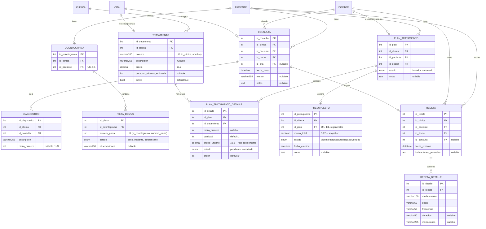

# Módulo 5 — Expediente clínico avanzado (BE-05)

**Asignado:** Meli · **Depende de:** BE-04 (listo). **Habilita:** BE-06 (presupuesto → factura).

## 0. Alcance, tal como lo fija la tabla del roadmap

> Diagnósticos, odontogramas, planes de tratamiento, presupuestos, recetas, historial de consultas.

Seis piezas, y las seis entran en este módulo — `MODULOS_DISPONIBLES` (Módulo 2) ya reserva los
feature flags `odontogramas`, `presupuestos` y `recetas` desde que se sembraron los ocho módulos por
clínica, así que el propio código ya asumía este reparto antes de que este spec existiera.

**Fuera, y por qué:** `Factura` y la numeración/impuesto sobre el presupuesto aceptado son BE-06
("Presupuesto → plan de tratamiento → factura"). Este módulo deja el `Presupuesto` como documento
con un total, sin convertirlo en dinero cobrado — igual que el Módulo 3 dejó `Tratamiento` fuera de
su alcance para que este módulo lo definiera.

## 1. La decisión de política que quedó pendiente al cerrar el Módulo 4

La sección 11 de `2026-08-02-modulo-4-operacion-clinica-design.md` deja tres caminos sobre qué
significa una referencia a algo dado de baja, y pide resolverlo antes de empezar este módulo porque
`Paciente` y `Doctor` van a acumular referencias nuevas (`PlanTratamiento`, y a través de él,
`Consulta`, `Odontograma`, `Receta`).

**Se adopta la opción recomendada por ese spec: bloquear la baja si hay referencias activas.**
`DELETE /pacientes/{id}` y `DELETE /doctores/{id}` devuelven `409` si el paciente o el doctor tiene
un `PlanTratamiento` en un estado no terminal (`borrador`, `aprobado` o `en_progreso`). Mismo
criterio para `DELETE /tratamientos/{id}`: no se puede desactivar un procedimiento del catálogo si
algún plan activo tiene un detalle pendiente o en progreso con ese tratamiento.

**Por qué esta y no las otras dos:** cancelar en cascada tomaría una decisión clínica en nombre de la
clínica (cerrar un plan de tratamiento a alguien sin que nadie lo revise) — inaceptable para una
ficha médica. Aceptar referencias inactivas sin bloquear nada perpetuaría el bug que ya se documentó
en `Cita` (una cita puede quedar huérfana de un doctor de baja) en tres entidades nuevas en vez de
una. Bloquear es lo único que no decide nada en nombre de nadie: le devuelve el problema a quien lo
puede resolver (reasignar el plan a otro doctor, o cerrarlo a mano) con un `409` que dice
exactamente qué hay que resolver.

**Alcance de esta corrección:** solo `PlanTratamiento` activa el bloqueo. `Consulta`, `Diagnostico`,
`Odontograma` y `Receta` son historial — no tiene sentido "bloquear" el registro de algo que ya
pasó. Y la deuda ya documentada en la sección 11 del Módulo 4 (citas y consultorios/especialidades
inactivos) **no se toca**: sigue siendo deuda conocida de ese módulo, fuera de alcance acá.

## 2. Modelo de datos

Cuatro archivos nuevos en `app/models/`, todos usando `values_callable` en sus enums desde el
principio (bug #2 del CONTEXTO, solo revienta contra MySQL):



**Archivos:**

- `app/models/expediente.py` — `Tratamiento`, `Consulta`, `Diagnostico`, `Odontograma`,
  `PiezaDental`, `EstadoPiezaDental`.
- `app/models/plan_tratamiento.py` — `PlanTratamiento`, `PlanTratamientoDetalle`,
  `EstadoPlanTratamiento`, `EstadoDetallePlanTratamiento`, `TRANSICIONES_PLAN_PERMITIDAS`.
- `app/models/presupuesto.py` — `Presupuesto`, `EstadoPresupuesto`.
- `app/models/receta.py` — `Receta`, `RecetaDetalle`.
- `app/models/cita.py` (editado) — se agrega `Cita.id_tratamiento` (nullable, FK a
  `tratamiento.id_tratamiento`). Es la columna que el Módulo 4 dejó anunciada ("la FK
  `Cita.id_tratamiento` se agrega ahí con una migración de una columna"): qué procedimiento del
  catálogo se realizó en esa cita puntual. No reemplaza a `PlanTratamientoDetalle`: una cita puede
  no tener plan (una limpieza de rutina sin plan armado) y un plan puede tener detalles que no
  vinieron de ninguna cita puntual (se agenda después).

### Ocho decisiones de modelado

| # | Decisión | Por qué |
|---|---|---|
| 1 | `PlanTratamientoDetalle.precio_unitario` se copia de `Tratamiento.precio` al crear el detalle, no se lee en vivo | Misma foto-del-momento que `Cita.duracion_minutos` (Módulo 4). Si la clínica sube el precio de una limpieza, los planes ya armados no deben encarecerse solos. |
| 2 | `Presupuesto` es 1:1 con `PlanTratamiento` (FK única) y se **regenera**, no se versiona | Un presupuesto es la foto del total de un plan en un momento dado. Si el plan cambia (se agrega o cancela un detalle), el presupuesto vigente queda desactualizado y hay que volver a generarlo — no tiene sentido acumular presupuestos viejos de un plan que sigue vivo. Si la clínica algún día necesita historial de versiones de presupuesto, es una decisión de BE-06, no de acá. |
| 3 | `Odontograma` no crea las 32 filas de `PiezaDental` al crearse | Igual que `HorarioClinica` (Módulo 3): la fila se crea perezosamente la primera vez que alguien registra un hallazgo en esa pieza, y `listar_piezas` rellena con `sano` las que faltan. Crear 32 filas vacías por cada paciente nuevo es trabajo sin uso: la mayoría de un odontograma sano no se va a tocar nunca. |
| 4 | El `PUT` del odontograma acepta un subconjunto de piezas, no las 32 completas | Se aparta a propósito del patrón "reemplazar la semana completa" de `HorarioClinica`/`HorarioDoctor`. Ahí un horario se edita como unidad porque un bloque a medias rompe el negocio (un consultorio sin hora de cierre). Un odontograma no: un dentista registra 1-3 piezas por consulta, y obligarlo a reenviar las 32 (la mayoría sin cambios) invita a que un cliente desactualizado sobrescriba con datos viejos las piezas que otro dentista actualizó después. Cada pieza se upsert de forma independiente. |
| 5 | `Consulta.id_cita` es nullable | No toda consulta viene de una cita agendada en el sistema (una urgencia sin turno previo, o una consulta importada del legacy). Cuando existe, es solo trazabilidad — el registro clínico permanente es la `Consulta`, no la `Cita`. |
| 6 | `PlanTratamientoDetalle` tiene su propio estado (`pendiente`/`en_progreso`/`completado`/`cancelado`), independiente del estado del `PlanTratamiento` | Un plan `en_progreso` normalmente tiene detalles en los tres estados no-cancelados a la vez (una limpieza ya hecha, una endodoncia en curso, una corona todavía pendiente). Colapsar todo al estado del plan perdería esa granularidad, que es la que necesita `PresupuestoService` para saber qué sigue sumando al total. |
| 7 | `RecetaDetalle` es una tabla, no un campo de texto libre con todos los medicamentos | Mismo criterio que `MetodoPago` en el Módulo 3: extender (agregar un medicamento más) tiene que ser una fila nueva, no reescribir un bloque de texto donde un parser tendría que inventar una estructura que el dominio ya tiene. |
| 8 | `Cita.id_tratamiento` es nullable y no se valida contra el catálogo al agendar | La cita se agenda antes de saber con certeza qué se va a hacer (eso lo decide el doctor en el consultorio). Exigirlo en `POST /citas` reabriría `CitaService` y sus siete validadores para un dato que en la práctica se completa después, con un `PATCH` liviano. Se valida solo que, si viene, el tratamiento sea de la misma clínica y esté activo — la misma regla que ya aplican los otros campos opcionales de `Cita`. |

## 3. Repositorios

Un archivo por entidad, salvo los pares padre-detalle que se resuelven en un solo archivo (mismo
criterio que `personas.py` agrupando `Paciente`/`Doctor`/`Asistente`/`HorarioDoctor` — je, en
realidad esos son cuatro clases en un archivo de *modelos*; a nivel de *repositorio* cada uno tiene
el suyo, y aquí se sigue esa misma separación):

- `tratamiento_repository.py` — `TratamientoRepository(CatalogoRepository[Tratamiento])`. Hereda
  igual que `EspecialidadRepository`: dos líneas para el CRUD, más un `eliminar` que **sobreescribe**
  el de `CatalogoRepository` para anteponer el chequeo de uso (sección 1) antes de desactivar.
- `consulta_repository.py` — `ConsultaRepository(BaseRepository[Consulta])`. `eliminar` no está
  implementado (`NotImplementedError`), igual que `CitaRepository`: una consulta no se borra, es
  historial.
- `diagnostico_repository.py` — `DiagnosticoRepository(BaseRepository[Diagnostico])`. CRUD simple,
  sin `eliminar` real tampoco (un diagnóstico registrado no se borra; si estaba mal, se corrige el
  texto con un `PUT` o se agrega uno nuevo que lo corrija — la corrección también es historial).
- `odontograma_repository.py` — `OdontogramaRepository`. **No hereda `BaseRepository`**: la unidad
  de trabajo real es la pieza, no el odontograma (que es solo el contenedor 1:1). Métodos:
  `obtener_o_crear(id_clinica, id_paciente)` (mismo patrón que
  `ConfiguracionClinicaRepository.obtener_o_crear`), `listar_piezas(id_clinica, id_paciente)`
  (rellena con `sano` las 32 que falten, mismo patrón que `HorarioClinicaRepository.listar_semana`),
  `actualizar_pieza(id_clinica, id_paciente, numero_pieza, data)` (upsert de una).
- `plan_tratamiento_repository.py` — `PlanTratamientoRepository(BaseRepository[PlanTratamiento])`
  más `PlanTratamientoDetalleRepository` en el mismo archivo (el detalle no tiene sentido sin el
  plan, y sus queries siempre entran por el plan — mismo criterio que separó `HorarioDoctor` en su
  propio archivo pero no en su propio repositorio de primer nivel... en este caso sí amerita su
  propia clase porque el detalle tiene su propia máquina de estados). Trae también
  `existe_plan_activo_de_paciente` y `existe_plan_activo_de_doctor`, que usan `PacienteRepository`/
  `PersonalService` para la política de la sección 1.
- `presupuesto_repository.py` — `PresupuestoRepository(BaseRepository[Presupuesto])`, más
  `obtener_por_plan(id_clinica, id_plan)`.
- `receta_repository.py` — `RecetaRepository(BaseRepository[Receta])` más
  `RecetaDetalleRepository` en el mismo archivo, mismo criterio que el plan.

## 4. Servicios

Solo donde hay coordinación entre repositorios o una transacción con más de una escritura — el
resto es CRUD de una entidad y la ruta llama al repositorio directo (`Diagnostico`, `Odontograma`,
`Tratamiento`), igual que el Módulo 3 con sus catálogos.

- **`ConsultaService`** — valida que paciente y doctor existan, estén activos y sean de la clínica
  antes de crear la consulta (dos chequeos, no siete: no amerita el patrón de validadores
  independientes del Módulo 4, que se justifica cuando las reglas son muchas y cada una se testea
  sola).
- **`PlanTratamientoService`** — crea el plan, agrega/edita/cancela detalles (copiando el precio del
  tratamiento al agregar, sección 2 decisión 1), y cambia el estado del plan con una tabla de
  transiciones (`TRANSICIONES_PLAN_PERMITIDAS`) del mismo espíritu que `TRANSICIONES_PERMITIDAS` de
  `Cita`, aunque más simple (cuatro reglas, no siete, y no hace falta un objeto por regla).
- **`PresupuestoService`** — `generar_o_regenerar(id_clinica, id_plan)` suma
  `precio_unitario * cantidad` de los detalles no cancelados y crea o actualiza el `Presupuesto` del
  plan (según la decisión 2, es upsert, no historial). `cambiar_estado` (aceptar/rechazar).
- **`RecetaService`** — alta transaccional de `Receta` + sus `RecetaDetalle` en una sola operación
  con `commit`/`rollback` explícito, copiando el patrón de `PersonalService.crear_doctor`: la receta
  sin al menos un medicamento no tiene sentido, así que se crean juntos o no se crea ninguno.

**La política de bajas (sección 1) no vive en un servicio nuevo**: se aplica extendiendo lo que ya
existe, porque las dos entidades que hay que proteger (`Paciente`, `Doctor`) ya tienen su punto único
de baja:

- `PacienteRepository.eliminar` consulta `PlanTratamientoRepository.existe_plan_activo_de_paciente`
  antes de poner `activo=False`, y lanza `ReferenciaEnUsoError` si hay alguno.
- `PersonalService.dar_de_baja_doctor` hace lo mismo con `existe_plan_activo_de_doctor`, **antes**
  de llamar a `_cambiar_actividad` (así no hay que tocar esa función, que ya coordina perfil +
  `Usuario`).

## 5. Endpoints

```
GET/POST      /tratamientos                     (LECTURA: 4 roles · ESCRITURA: admin, superadmin)
GET/PUT       /tratamientos/{id}
DELETE        /tratamientos/{id}                 409 si hay un detalle de plan activo que lo usa

GET/POST      /consultas                         (LECTURA: 4 roles · ESCRITURA: admin, asistente, doctor)
GET/PUT       /consultas/{id}
GET/POST      /consultas/{id}/diagnosticos

GET/PUT       /pacientes/{id}/odontograma        (crea al vuelo, upsert parcial de piezas)

GET/POST      /planes-tratamiento                (LECTURA: 4 roles · ESCRITURA: admin, asistente, doctor)
GET           /planes-tratamiento/{id}
PATCH         /planes-tratamiento/{id}/estado
POST          /planes-tratamiento/{id}/detalles
PATCH         /planes-tratamiento/{id}/detalles/{id_detalle}

GET/POST      /planes-tratamiento/{id}/presupuesto   (POST regenera si ya existe)
PATCH         /presupuestos/{id}/estado

GET/POST      /recetas                            (LECTURA: 4 roles · ESCRITURA: admin, doctor)
GET           /recetas/{id}
```

**Permisos, entidad por entidad, no una regla única:** este módulo hereda la tensión que el Módulo 4
ya resolvió (configuración vs. operación diaria), y cada entidad cae en un lado según quién la toca
en la realidad:

| Recurso | Leer | Escribir |
|---|---|---|
| `Tratamiento` (catálogo/precio) | los 4 roles | superadmin, admin — es dinero, como `MetodoPago` |
| `Consulta`, `Diagnostico`, `PlanTratamiento`, `Receta` | los 4 roles | superadmin, admin, asistente, doctor — igual que `Paciente`/`Cita`: quien atiende registra |
| `Odontograma` | los 4 roles | superadmin, admin, doctor — un asistente no diagnostica, aunque sí puede agendar y registrar pacientes |
| `Presupuesto` | los 4 roles | superadmin, admin, asistente — presentarle un presupuesto al paciente es tarea de recepción, no del doctor |

## 6. Migración

Una sola migración nueva, `0005`, con las siete tablas y la columna `Cita.id_tratamiento`. No se
edita `0004` (regla dura del proyecto: nunca editar una migración ya aplicada).

## 7. Deuda que este módulo no resuelve, a propósito

- **La deuda del Módulo 4 sobre `Cita`, `Consultorio` y `Especialidad` inactivos sigue abierta.**
  Este módulo resuelve la política **para `PlanTratamiento`**, que es la que bloqueaba avanzar; no
  amplía el arreglo a las referencias que ya existían en `Cita`. Cerrar esa parte es trabajo
  aparte, sobre código del Módulo 4, y mezclarlo aquí infla el diff de este módulo con cambios que
  no le pertenecen.
- **No hay versionado de presupuestos.** Se decidió (sección 2, decisión 2) que un presupuesto se
  regenera. Si la clínica alguna vez necesita comparar "el presupuesto que se le mostró al paciente
  el mes pasado" contra el actual, hace falta una tabla de historial — no es parte de este módulo.
- **`Cita.id_tratamiento` no obliga a completar el catálogo antes de cerrar una cita.** Una clínica
  puede operar sin llenarlo nunca; es un dato opcional para cuando BE-07 (dashboards) quiera cruzar
  "qué se hizo" contra "cuánto se cobró" vía BE-06. No lo bloquea ningún flujo de este módulo.
- **`PresupuestoRepository` y `PlanTratamientoRepository` no chequean que el `Presupuesto` de un plan
  cancelado se marque `vencido` automáticamente.** Queda en estado `vigente` hasta que alguien lo
  cambie a mano. Cerrarlo bien necesita decidir si es un job programado o una regla del propio
  cambio de estado del plan — territorio de BE-08 (notificaciones/recordatorios) o de este módulo en
  una segunda pasada, no ahora.
